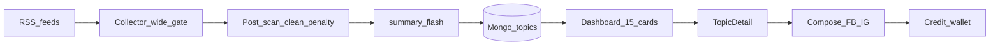

# Alter Ego — 第三方一頁架構說明（短版）

> **用途**：給外部顧問／廠商／投資技術盡調 **一次讀完**（約 10–15 分鐘）。  
> **不是**完整規格；細節以 [`專案完整架構表_v8.md`](../專案完整架構表_v8.md) 與 [`README.md`](../README.md) 為準。  
> **日期**：2026-09-18（星期五）· 產品狀態：**已上架營運**

---

## 1. 產品是什麼

**Alter Ego**（對外品牌）／程式庫名 Influencers AI Agents。  
幫助創作者／網紅：**每天看趨勢主題卡 → 用自己的語氣組出可發社群文案**。

| 對象 | 價值 |
|------|------|
| 訪客 | Welcome 了解產品；點數貨架導流登入 |
| 登入用戶 | Dashboard 今日頭條；詳情組裝 FB／IG 貼文；點數解鎖／組裝 |
| 營運／Admin | 排程產卡、告警日報、Style Trainer（內部） |

**正式域**：前端 `https://ai-alterego.com` · API `https://api.ai-alterego.com`  
**託管**：Vercel（前端）＋ Railway（後端 FastAPI）＋ MongoDB Atlas

---

## 2. 一句話資料流

```text
RSS／媒體頁
  → 抽取＋清洗（寬門：寧可產卡，殼／雜訊沉底）
  → 每日 04:00 HKT 產滿 15 張公眾卡（時尚／美食／趨勢各 5）
  → Dashboard 展示（看卡免費）
  → 詳情：事實摘要／源文＋組裝器（扣點）出 FB／IG 文案
```



---

## 3. 技術棧（對外夠用）

| 層 | 技術 |
|----|------|
| 前端 | React／Vite／TypeScript；三語 UI（zh-TW／en／ja） |
| 後端 | FastAPI（Python）；JWT 登入 |
| 資料 | MongoDB（主題卡、點數錢包、Alter Ego DNA） |
| AI | DeepSeek Flash（摘要／組裝）；DeepL（標題／預載翻譯，可選） |
| 金流 | Stripe Checkout 一次過（US$3／5／10 點數包） |
| 郵件 | Resend（營運日報等） |

**不做／已凍結方向**：不以 PostgreSQL／NLLB 為主線；產卡預設 **`generate_content=false`**（不在收集時自動長文）。

---

## 4. 核心產品模組

| 模組 | 說明 |
|------|------|
| **公眾主題卡** | 排程每日 15 張；`summary_flash`≈300 字為事實錨；列表看不扣點 |
| **抽取品質** | RSS 正文優先於 HTTP；導覽殼不當成功正文；雜訊→`sort_penalty` 沉後，**不轻易拒產** |
| **主題詳情** | 源文／譯文／事實摘要；壞文回退 flash；精選圖最多 4 張 2×2 |
| **組裝器** | `POST /alter-ego/compose`；平台 FB／IG；短≤500／長≤1500；成功扣點 |
| **Alter Ego** | 範文提取語氣 DNA；組裝可套用戶語氣（風格與題材詞庫解耦，防污染） |
| **My Channel** | 用戶自有 RSS 頻道（與公眾 15 卡分開；解鎖另計） |
| **點數** | 歡迎贈點＋每日免費帽；購買點不過期；Mongo wallet 為帳本 SoT |
| **營運** | `/health`、產卡 watchdog、每日 digest；問題卡可 `hidden`（不手刪庫） |

---

## 5. 鐵律（改碼前必知）

1. **多語言**：使用者可見字禁止硬編碼；zh-TW／en／ja 鍵必須對齊（規則 17）。  
2. **事實錨定**：出文以 `summary_flash`／源文為準；風格 DNA 只導語氣，不硬套無關名詞（規則 19）。  
3. **按需生成**：詳情不背景偷跑 LLM；用戶點擊才組裝。  
4. **Git**：不直改 `main`；合入走 feature＋PR；pre-commit 五道門禁（結構／i18n／管線／單元測等）。  
5. **寬門產卡**：優化抽取／沉底可以；**禁止**為「正文完美」關掉每日滿額能力。

---

## 6. 與「完整架構表」怎麼分工

| 文件 | 給誰 | 何時讀 |
|------|------|--------|
| **本檔（短版）** | 第三方首次對齊 | 先讀完即可開會 |
| [`專案完整架構表_v8.md`](../專案完整架構表_v8.md)（~1100 行） | 接手工程／深審 | 動路由、產卡、金流、DNS 前 |
| [`開發人員必讀規則.md`](../開發人員必讀規則.md) | 寫 code 的人 | 開碼前 |
| [`工作記錄.md`](../工作記錄.md) | 進度／決策日期 | 對齊「現在做到哪」 |
| [`docs/alter_ego_launch_dns_checklist.md`](./alter_ego_launch_dns_checklist.md) | 上線／DNS／OAuth | 碰正式域時 |

---

## 7. 一句話邊界（避免誤解）

- **是**：趨勢選題＋來源錨定＋語氣組裝＋點數變現的創作工作流。  
- **不是**：全自動代發全平台、通用聊天機器人、或「Q 分低就不產卡」的嚴格過濾工廠。  
- **遠期可談**：客戶自選多頻道／租戶隔離；**不在本短版承諾工期**。

---

*維護：與 v8 架構表重大變更時同步改本檔日期與 §2–§4；勿把完整 changelog 貼進本檔。*
