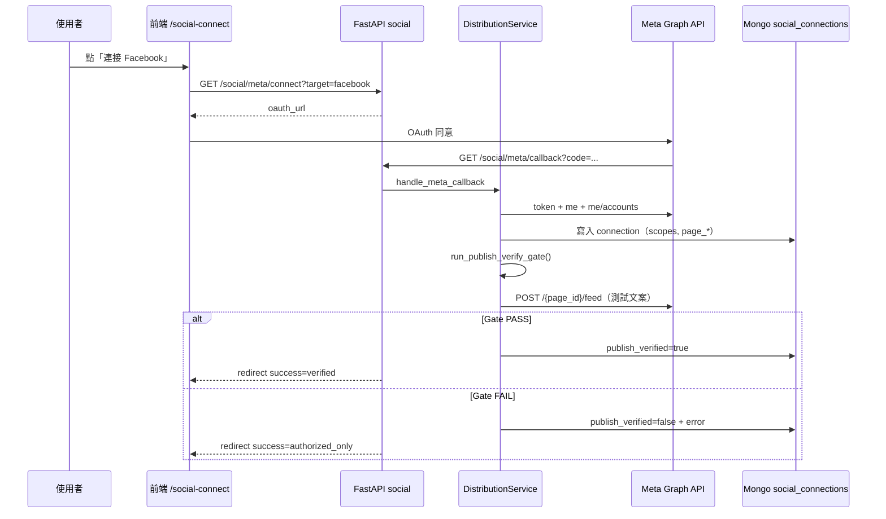

# 社交平台連線試發文 Gate — 開發架構與 Checklist

> **版本**：v0.1（規格草案）  
> **建立日期**：2026-05-27  
> **狀態**：⏸️ **L2 選配／延後** — **非 MVP 主路**  
> **MVP 主路（L0）**：[`publish_post_kit_spec.md`](./publish_post_kit_spec.md) — **Post Kit + Copy**，使用者於自有平台發布。  
> **相關**：[`工作記錄.md`](../工作記錄.md)、[`Facebook_App_設定指南.md`](./Facebook_App_設定指南.md)

---

## 0. 與產品主路的關係（2026-05-27）

| 層級 | 文件 | 驗收焦點 |
|:----:|------|----------|
| **L0** | [`publish_post_kit_spec.md`](./publish_post_kit_spec.md) | 標題／內文／Hashtag／照片 **copy** |
| **L2** | **本文件** | OAuth + **試發文 Gate** + `POST /social/publish` |

測試週 **S4-6／S4-7／矩陣 H（代發）** 在 L0 下標 **N/A** 或僅記錄現況；**實作 Gate 前勿以「已連接」當產品 PASS**。

---

## 1. 核心（一句）

**「已連接」≠ 驗收通過**；Facebook 連線須在 OAuth 成功後完成 **試發文（或等價 Graph 探針）**，通過才標 **`publish_verified`**，否則 UI 顯示 **已授權、尚未驗證發布**。（**僅適用 L2 API 代發路線。**）

---

## 2. 背景與問題

| 現象 | 為何是「空殼連線」 |
|------|-------------------|
| `/social-connect` 顯示綠色「已連接」 | 僅表示 OAuth token 已寫入 `social_connections` |
| `/publish` 按發布仍失敗 | 常缺 `pages_manage_posts`、無 Page、或僅個人 token |
| 測試記 S4-6「能開頁」 | 未驗證 **POST …/social/publish** 業務成功 |
| T-10 Meta「授權頁 PASS」 | 未要求 **試發文 200** |

**產品共識（2026-05-27）**：分發（Phase 5）的核心交付是 **能發佈**；連線流程必須證明這一點，否則對使用者與測試週皆無意義。

---

## 3. 目標與非目標

### 3.1 目標（本文件範圍）

- 定義 **連線狀態分級**（授權 vs 可發布驗證）。
- 在 **Meta Facebook OAuth 回呼** 內嵌 **Publish Verify Gate**（試發文）。
- 前端 `/social-connect`、`/publish` 依狀態顯示與阻擋。
- 提供 **開發 Checklist** 與 **測試週 Checklist**（對齊 S4-6、S4-7、gap #3、矩陣 H）。

### 3.2 非目標（本階段不做）

- Instagram／Threads 完整 Gate（另開附錄規格；本文件僅 **Facebook Page feed** 為 P0 參考實作）。
- 正式環境大量自動發文／行銷排程（僅 **連線驗證用單則測試貼**）。
- 為 Gate 修改 ngrok／HTTPS／既有登入架構（遵守規則 #14）。
- 回溯匯入歷史 `interactions` 至 `ratings`（選做 P2）。

---

## 4. 連線狀態定義

### 4.1 狀態欄位（建議 Mongo `social_connections`）

| 欄位 | 型別 | 說明 |
|------|------|------|
| `status` | enum | `connected` \| `disconnected` \| `expired` \| `error`（沿用） |
| `publish_verified` | bool | **`true`**＝試發文 Gate PASS |
| `publish_verified_at` | datetime | 最後驗證成功時間 |
| `publish_verify_error` | string? | 最後驗證失敗原因（i18n key 或 Graph 摘要） |
| `page_id` | string? | Facebook Page ID（已有／待補） |
| `page_access_token` | string? | Page token（已有／待補） |
| `page_name` | string? | 顯示用 |
| `scopes` | string[] | 實際授權 scope 列表 |

### 4.2 UI 對照（禁止混淆）

| `status` | `publish_verified` | `/social-connect` 顯示 | `/publish` 行為 |
|:--------:|:------------------:|------------------------|-----------------|
| connected | **true** | **已驗證可發布**（綠） | 可選平台發布 |
| connected | **false** | **已授權，尚未驗證發布**（黃） | 阻擋或強提示「重新驗證」 |
| error / 無連線 | — | 未連接／連線失敗 | 引導連線 |

**禁止**：僅 OAuth 成功即顯示「Facebook 已連接」且語意等同「可發文」。

---

## 5. 架構總覽



### 5.1 模組邊界

| 層 | 職責 |
|----|------|
| **`distribution_service`** | OAuth、Page 解析、**`verify_publish_capability()`**、正式 `publish_content` |
| **`social.py`** | HTTP、redirect query（`verified` / `reason`）、列表 API 回傳 `publish_verified` |
| **`SocialConnectionRepository`** | 持久化驗證欄位 |
| **`Publish.tsx` / `SocialConnect.tsx`** | 依 `publish_verified` 顯示；未驗證時 CTA「重新驗證連線」 |
| **`check_meta_config.py`** | 檢查 `META_OAUTH_INCLUDE_PUBLISH`、App ID 等 |

---

## 6. Publish Verify Gate（後端規格）

### 6.1 觸發時機

| 時機 | 是否執行 Gate | 備註 |
|------|:-------------:|------|
| Meta OAuth callback（`target=facebook`） | **是（P0）** | 主路徑 |
| 使用者點「重新驗證發布」 | **是（P1）** | `POST /social/facebook/verify-publish` |
| 僅開啟 `/social-connect` 列表 | 否 | 只讀上次結果 |
| `/publish` 正式發布 | 否（但須檢查 `publish_verified`） | 未驗證 → 400 + i18n |

### 6.2 試發文內容（固定模板）

```text
[Influencers AI 連線測試] {ISO8601_UTC} — 可刪除
```

- **語言**：依 `get_user_language` 可選 zh-TW／en 前綴（i18n key：`social.verifyPostBody`）。
- **可見性**：僅發到 **Page feed**（非 Messenger 私訊）；產品用語統一為 **「發布貼文」** 避免與「發訊息」混淆。
- **刪除**：P2 可選呼叫 Graph 刪帖；P0 **不強制**（開發帳手動刪即可）。

### 6.3 Gate 演算法（Facebook）

```
1. access_token 有效
2. GET me/accounts → 至少 1 個 Page（或 connection 已有 page_id + page_access_token）
3. scopes 含 pages_manage_posts（或 META_OAUTH_INCLUDE_PUBLISH 已開且 token 帶權限）
4. POST /{page_id}/feed { message: 測試文案 } → HTTP 200
5. 寫入 publish_verified=true、post_id（可選存 verify_post_id）
```

**失敗分類**（寫入 `publish_verify_error` / redirect `reason`）：

| code | 條件 | 使用者訊息方向 |
|------|------|----------------|
| `NO_PAGE` | `me/accounts` 空 | 需建立或授權粉絲專頁 |
| `MISSING_PUBLISH_SCOPE` | 無 `pages_manage_posts` | `.env` 開 publish scope 後重新連線 |
| `GRAPH_POST_FAILED` | POST feed 非 200 | 貼 Graph 錯誤摘要 |
| `TOKEN_INVALID` | token 交換／me 失敗 | 重新 OAuth |

### 6.4 API 擴充（草案）

| 方法 | 路徑 | 說明 |
|------|------|------|
| GET | `/api/v1/social/meta/callback` | redirect 增參：`?success=true&verified=1` 或 `&verified=0&reason=NO_PAGE` |
| POST | `/api/v1/social/facebook/verify-publish` | 手動重跑 Gate（已連線用戶） |
| GET | `/api/v1/social/connections` | 每筆含 `publish_verified`、`publish_verify_error`、`page_name` |
| POST | `/api/v1/social/publish` | 若 `publish_verified=false` → **400** `social.publish_not_verified` |

### 6.5 與現有程式關係（2026-05-27 本機）

| 項目 | 狀態 |
|------|------|
| `interactions` → `ratings`／`style_profiles` | ✅ 已接線 |
| `GET /style-profile/analysis` get_or_create | ✅ 已修 |
| `publish_queue` 錯誤 `id_field` → 500 | ✅ 已修（待 PR） |
| callback 寫入第一個 Page | ✅ 已修 |
| **Gate 試發文** | ☐ **本文件待實作** |

---

## 7. 前端規格

### 7.1 `/social-connect`

- 卡片狀態三態：**未連接**／**已授權未驗證**／**已驗證可發布**。
- OAuth 回來解析 query：`verified=1|0`、`reason=*` → toast + 更新列表。
- **`data-testid`**（對照 [`按鈕測試ID架構表.md`](../按鈕測試ID架構表.md)）建議：
  - `badge-social-facebook-verified`
  - `btn-social-facebook-verify-publish`
  - `link-social-facebook-reconnect`

### 7.2 `/publish`

- 平台勾選：若 Facebook `publish_verified=false` → 禁用或顯示警告條。
- 發布失敗時顯示 `results[].error_message`（已有 API 結構）。

### 7.3 i18n（須三語）

新增 key 範例（`frontend/src/i18n/index.ts`）：

- `social.status.authorizedOnly`
- `social.status.publishVerified`
- `social.verifyPostFailed.NO_PAGE`
- `social.publishNotVerified`
- `social.action.reverifyPublish`

---

## 8. 環境與 Meta App

| 變數 | 開發建議 | 說明 |
|------|----------|------|
| `META_APP_ID` / `META_APP_SECRET` | 必填 | 見 `check_meta_config.py` |
| `BACKEND_URL` | `http://localhost:8000` | callback 一致 |
| **`META_OAUTH_INCLUDE_PUBLISH`** | **`true`**（開發 Gate 必開） | 加入 `pages_manage_posts` 等 |
| Meta App 測試用戶 | 必填（開發模式） | 見 [`Facebook_App_設定指南.md`](./Facebook_App_設定指南.md) |
| Facebook Page | 至少 1 個 | 個人帳號無 Page 無法通過 Gate |

**注意**：生產環境須 App Review 通過發布權限；開發模式僅限測試用戶。

---

## 9. 開發階段

| 階段 | 內容 | 完成判定 |
|------|------|----------|
| **A** | 後端 `verify_publish_capability` + callback 內呼叫；DB 欄位；redirect query | 新連線後 DB `publish_verified` 正確 |
| **B** | 前端三態 UI + i18n + testid | 肉眼可區分「已授權」vs「可發布」 |
| **C** | `POST verify-publish`；`/publish` 阻擋未驗證；更新 check_meta、`.env.example` | 手測腳本全過 |
| **D** | 測試文件：本 checklist 勾選；`test_week_daily_checklist` 矩陣 H 升級 | S4-6/S4-7 新標準 |

建議分支：`feature/social-publish-verify-gate`

---

## 10. 開發 Checklist

### 10.1 後端

- [ ] `social_connections` 新增 `publish_verified`、`publish_verified_at`、`publish_verify_error`（migration 或懶遷移）
- [ ] `DistributionService.verify_publish_capability(user_id, connection, language)` 實作
- [ ] `handle_meta_callback`（facebook）成功寫入 connection 後 **await verify**（失敗不 rollback OAuth，但 `publish_verified=false`）
- [ ] redirect：`/social-connect?success=true&target=facebook&verified=0|1&reason=...`
- [ ] `POST /social/facebook/verify-publish`（P1）
- [ ] `POST /social/publish` 檢查 `publish_verified`（facebook 平台）
- [ ] i18n：`social.publish_not_verified`、`distribution.facebook_*` 已有者複用
- [ ] 單元測試：mock Graph → PASS／NO_PAGE／MISSING_SCOPE
- [ ] `backend/check_meta_config.py` 警告：未設 `META_OAUTH_INCLUDE_PUBLISH`

### 10.2 前端

- [ ] `socialApi` 型別含 `publish_verified`、`publish_verify_error`
- [ ] `SocialConnect` 三態 badge + 重新驗證按鈕
- [ ] 解析 callback query → toast
- [ ] `Publish` 未驗證時禁用 Facebook 或顯示橫幅
- [ ] i18n zh-TW／en／ja 齊全
- [ ] `data-testid` 對照架構表補登

### 10.3 文件

- [ ] 更新 [`Facebook_App_設定指南.md`](./Facebook_App_設定指南.md)「連線＝試發文通過」
- [ ] [`工作記錄.md`](../工作記錄.md) 鏈結本文件；實作後勾選待改表
- [ ] [`專案完整架構表.md`](../專案完整架構表.md) Phase 5 列新增 API（若動路由）

---

## 11. 測試 Checklist（手測／測試週）

> **禁止模糊簽收**：Meta／發布相關不得僅「能開頁／已連接」；須 **Network + 業務結果**。

### 11.1 Gate 專項（新連線全流程）

| # | 步驟 | UI 預期 | Network 預期 | ☐ |
|:-:|------|---------|--------------|:-:|
| G1 | `.env` 設 `META_OAUTH_INCLUDE_PUBLISH=true`；重啟後端 | — | — | ☐ |
| G2 | `/social-connect` → 連接 Facebook → 完成 OAuth | 回頁後狀態符合 query | callback **302**；`verified=1` 或 `0` | ☐ |
| G3 | 若 `verified=1` | **已驗證可發布**；顯示 Page 名稱 | `GET connections` 含 `publish_verified: true` | ☐ |
| G4 | 若 `verified=0` + `NO_PAGE` | **已授權未驗證** + 原因 | 同上 `false` + `reason` | ☐ |
| G5 | `verified=1` 時 `/publish` 發測試文案 | 成功 toast | `POST …/social/publish` **200**；`successful≥1` | ☐ |
| G6 | Facebook 塗鴉牆／Page 可見測試貼（可選） | 貼文存在 | — | ☐ |
| G7 | 點「重新驗證發布」（P1） | 狀態更新 | `POST …/verify-publish` **200** | ☐ |

### 11.2 測試週對照（升級既有項）

| 原項 | 舊標準（不足） | 新標準（本文件） |
|------|----------------|------------------|
| **S4-6** `/publish` | 發布 UI 可見 | UI 可見 + **`publish_verified=true`** 時 `POST publish` **200**；否則 **PARTIAL** 記 `reason` |
| **S4-7** `/social-connect` | Facebook 已連接 | **`verified=1`** 或等同 API 欄位；僅 OAuth → **PARTIAL** |
| **gap #3** Meta #39 | 授權頁 + callback | 併 **G2～G5**；授權 alone 標「舊基線 PASS／發布待 Gate」 |
| **矩陣 H** H1～H2 | 連線成功 | H2 升級為 **試發文驗證** |

### 11.3 記錄格式（貼 `工作記錄.md`）

```text
Social Gate PASS — Facebook：OAuth + POST /{page}/feed 200；verify_post_id=…；publish_verified=true（截圖 G5）
Social Gate PARTIAL — OAuth OK；verified=0；reason=MISSING_PUBLISH_SCOPE（截圖 G4）
S4-6 PASS — 前提 publish_verified=true；POST …/publish 200
```

---

## 12. 風險與決策

| 風險 | 緩解 |
|------|------|
| 測試貼污染 Page | 固定前綴 `[Influencers AI 連線測試]`；文件要求開發帳；P2 自動刪 |
| App Review 未過導致生產無法發文 | 生產與開發分開記錄；UI 顯示「應用審核中」 |
| 使用者無 Page | Gate 失敗 + 教學連結建立粉專 |
| Gate 成功但日後 token 過期 | `publish` 失敗時提示「重新驗證」；排程檢查 `token_expires_at`（P2） |

**決策記錄**

| 日期 | 決策 |
|------|------|
| 2026-05-27 | 連線驗收必須包含試發文；獨立本文件為 SoT；Instagram／Threads Gate 延後 |

---

## 13. 修訂紀錄

| 日期 | 版本 | 說明 |
|------|------|------|
| 2026-05-27 | v0.1 | 初稿：架構、狀態、API、開發／測試 Checklist |
