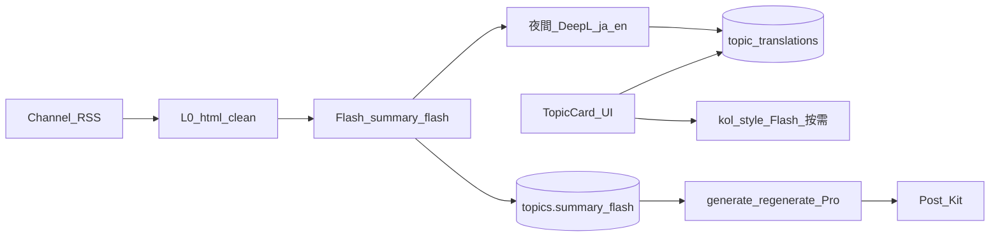

# 專案完整架構表（v7）

> **專案名稱**：Influencers AI（網紅 AI 助手）  
> **版本**：**v7.0.0**（上架收斂版 · 規格 SoT）  
> **更新日期**：2026-06-13（**Discover GTM 硬化規格** + Key 輪換 + 雙軌驗收）  
> **狀態**：📋 v7 **架構 SoT**；**程式**（分支 `feature/v7-cost-pipeline`）：Token 0～5、Phase A Sidebar、**Discover PF-0～4** ✅；**PF-H／PF-S／PF-B／PF-M** ⏳ 硬化待實作；**CD-*** ⏳ 整批測試週；**Key** 尾碼 **ebe36**（勿 commit `.env`）  
> **Discover**：**禁止** Node.js／PostgreSQL 主線／住宅 Proxy MVP；**唯一 Truth** = 現有 **FastAPI + MongoDB** 流水線擴充  
> **實作計畫**：`.cursor/plans/v7_token_省成本整合_050d25e8.plan.md`（與本檔同步）  
> **合併紀錄**：[PR #16](https://github.com/adamau1983119/AI_Agent_Webapp/pull/16) `docs/v7-spec-and-v6-freeze` → `main`  
> **v6 凍結（唯讀）**：[`專案完整架構表.md`](./專案完整架構表.md)、[`docs/archives/v6.0.0_專案完整架構表_凍結.md`](./docs/archives/v6.0.0_專案完整架構表_凍結.md)  
> **v7 需求**：[`docs/v7.0.0_需求文件.md`](./docs/v7.0.0_需求文件.md)  
> **版本政策**：[`docs/VERSIONING_POLICY.md`](./docs/VERSIONING_POLICY.md)

---

## 📋 v7 與 v6 差異一覽

| 維度 | v6.0.0 | v7.0.0 |
|------|--------|--------|
| 目標 | 功能全集 + 測試週 | **上架 MVP + 成本可控** |
| 架構表 | `專案完整架構表.md`（凍結） | **本檔**（唯一演進） |
| 主題收集翻譯 | 可開 `ENABLE_AI_TOPIC_TRANSLATION` | **預設關**；standard 走 **DeepL**（非收集時 Flash） |
| 卡片翻譯 | 方案 C + DeepSeek `_translate_title` | **`topic_translations`** + DeepL standard；**kol_style** 僅按需 Flash |
| 排程 6h×3 | 文件描述為常態 | **關**；改 **Channel 定向夜間** 預載（D3） |
| 長文生成模型 | 文件曾寫全站 Flash | **僅** generate/regenerate → **Pro**；其餘 **Flash**（D2） |
| 資料庫 | MongoDB topics | **+ `summary_flash`**、新 collection **`topic_translations`**（D1） |
| 導師模式 | 規格在案 | **UI 不承諾已上線** |
| AI 日誌 | 分散（model_used 等） | **`ai_generations`（規劃）** |
| PostgreSQL / NLLB | — | **禁止**（D1、D4） |
| 大眾免費主題卡（引流） | — | **Discover SKU**：8h RSS 批次、Redis→Mongo、`/discover` — **程式已實作**（未 commit；CD-* 待測） |

---

## 🎯 v7 產品架構（邏輯視圖）

```
┌─────────────────────────────────────────────────────────────────────────┐
│                     Influencers AI v7.0（上架 MVP）                      │
│                                                                         │
│  ┌───────────────────────────────────────────────────────────────────┐ │
│  │  P0 主路（對外）                                                   │ │
│  │  登入 → 頻道(RSS≤10) → 收集(L0) → summary_flash(Flash一次)         │ │
│  │       → 主題卡(DeepL standard 快取) → 詳情生成(Pro，僅此出口)        │ │
│  │       → Post Kit 複製發文                                          │ │
│  └───────────────────────────────────────────────────────────────────┘ │
│  ┌───────────────────────────────────────────────────────────────────┐ │
│  │  P1 可選／Beta                                                     │ │
│  │  靈感助手(Flash+CostMonitor) · Meta 連線 · Publish                 │ │
│  └───────────────────────────────────────────────────────────────────┘ │
│  ┌───────────────────────────────────────────────────────────────────┐ │
│  │  P2 隱藏／關閉（程式保留）                                         │ │
│  │  排程展示 · 主打三類自動收集 · 導師模式 · Style Profile · generate-today │ │
│  └───────────────────────────────────────────────────────────────────┘ │
│  ┌───────────────────────────────────────────────────────────────────┐ │
│  │  引流（Discover SKU · 已實作程式）                                   │ │
│  │  8h RSS 批次 → Flash 骨(summary_flash) → DeepL 皮(≤20字) → Mongo+Redis │ │
│  │  GET /public/topics/feed · 前端 /discover · 讀取 **0 LLM**          │ │
│  └───────────────────────────────────────────────────────────────────┘ │
│                                                                         │
│  ┌───────────────────────────────────────────────────────────────────┐ │
│  │  AI 分層                                                           │ │
│  │  L0 零元清洗 │ Flash 提煉 summary │ DeepL standard │ kol=Flash 按需   │ │
│  │  生成=Pro（僅 /contents/generate·regenerate）                        │ │
│  └───────────────────────────────────────────────────────────────────┘ │
└─────────────────────────────────────────────────────────────────────────┘
```

---

## 🛣️ 前端路由（v7 可見性）

> **實作檔**：`frontend/src/app/App.tsx`、`frontend/src/components/layout/Sidebar.tsx`  
> **v7 Sidebar**：`v7_nav` 過濾 **已實作**（2026-06-10 Phase A）

| 路徑 | 元件 | v7_nav | 說明 |
|------|------|:------:|------|
| `/` | RootRedirect | — | token→dashboard；無語言→language；否→login |
| `/language` | LanguageSelection | 公開 | |
| `/login` … `/privacy` | 認證／靜態 | 公開 | 同 v6 |
| `/dashboard` | Dashboard | **顯示** | |
| `/topics` | Topics | **顯示** | |
| `/topics/:id` | TopicDetail | **顯示** | 含 translate-display、生成內容 |
| `/channels` | Channels | **顯示** | |
| `/channels/create` | CreateChannel | **顯示** | 助手優先（v6 已落地） |
| `/channels/:id` | ChannelDetail | **顯示** | collect、topics |
| `/channels/:id/edit` | ChannelEdit | **顯示** | |
| `/inspiration` | Inspiration | **顯示** | 不提導師已上線 |
| `/preferences` | Preferences | **顯示** | |
| `/settings` | Settings | **顯示** | Header 選單 |
| `/schedule` | Schedule | **隱藏** | v7 無排程承諾 |
| `/style-profile` | StyleProfile | **隱藏** | |
| `/social-connect` | SocialConnect | **Beta** | |
| `/publish` | Publish | **Beta** | Post Kit |
| `/welcome` | — | v7.1 | Landing 規劃中 |
| `/discover` | Discover | **引流** | 只讀公共牆；**僅** `GET …/public/topics/feed`；**禁止**載入時觸發 LLM |

---

## 🔐 Token 省成本 — 客戶五項鎖定決策（2026-06-05 · 開發鐵律）

> **來源**：第三方「架構式蒸餾」規格對照；**已決案**，實作與 Code Review 以本節為準。  
> **禁止**：PostgreSQL 遷移、SQL/SQLAlchemy、NLLB-200、半夜 kol_style、全文進 LLM prompt。

### D1 資料庫：100% MongoDB 擴充

| 規則 | 內容 |
|------|------|
| 拒絕 | 遷移 PostgreSQL；第三方 `schema.sql` **不落地**，改映射 Mongo |
| `topics` | 新增 **`summary_flash: str`**（約 300 字；**唯一**進長文 LLM 的事實源） |
| 新 Collection | **`topic_translations`** |
| 索引 | **Motor** `create_index`：**`(topic_id, lang, type)` Unique Compound** |
| `type` | `standard_translation`（DeepL）｜`kol_style`（Flash，僅按需） |
| 相容讀取 | 先查 `topic_translations` → fallback `titles_i18n` |

**文檔形狀（規劃）**

```text
topic_translations: {
  topic_id, lang: zh-TW|en|ja,
  type: standard_translation|kol_style,
  cached_title, cached_content,
  provider: deepl|deepseek_flash|fallback,
  created_at, updated_at
}
```

冷存全文：沿用 `sources[].original_content`；**禁止**進任何 LLM prompt。

### D2 模型路由：混合分層

| 呼叫場景 | 模型／工具 |
|----------|------------|
| HTML 清洗、RSS 抓取 | **0 元**（爬蟲／extractor） |
| `summary_flash` 提煉、過濾、**kol_style** 改寫 | **`deepseek-v4-flash`**（`DEEPSEEK_MODEL_FLASH`） |
| standard 翻譯（卡片／預載） | **DeepL API** |
| **`POST /api/v1/contents/{topic_id}/generate`** | **`deepseek-v4-pro`**（`DEEPSEEK_MODEL_PRO`） |
| **`POST …/regenerate`** | 同上 **Pro** |

`.env` **必須**區分 `DEEPSEEK_MODEL_FLASH` 與 `DEEPSEEK_MODEL_PRO`；generate/regenerate **不得**沿用 Flash 預設。

### D3 背景排程：Channel 定向夜間預載

| 禁止 | 允許 |
|------|------|
| 每 6h `collect_fashion/food/trend` 三類全面收集 | **僅**指定 **港日媒體 Channel RSS** 定時抓取 |
| 收集管線內 AI 翻譯、半夜 **kol_style** | 流水線：**L0 清洗 → Flash `summary_flash` → DeepL 預載 `ja`+`en` `standard_translation` → 寫 `topic_translations`** |
| | **kol_style** 僅用戶進站點擊時觸發 |

| 環境變數 | 建議 |
|----------|------|
| `ENABLE_SCHEDULED_TOPIC_COLLECTION` | `false`（舊三類） |
| `ENABLE_CHANNEL_PREFETCH_PIPELINE` | `true`（**規劃**；定向 job） |

實作檔：`backend/app/services/automation/scheduler.py`（新 job，非重開三類）。

### D4 降級：P0 僅字串 Fallback

- DeepL **5 秒**硬超時或 API 錯誤 → 回傳 `"[Fallback-JA] " + summary_flash` 或 `"[Fallback-EN] " + …`
- 日誌前綴：`[TRANSLATION_FALLBACK_TRIGGERED]`
- **不做** NLLB、自架小模型

規劃模組：`backend/app/services/translation/deepl_provider.py`（`translate_with_fallback`）。

### D5 Prompt：短文本斷流（不強制 API Context Cache）

- **不實作** DeepSeek prefix caching 控制邏輯
- **SYSTEM_PROMPT** 固化為靜態常數、極簡
- 所有 Flash／**Pro 產文**輸入以 **`summary_flash`（~300 字）** 為主；**禁止** `original_content`／HTML 進 prompt
- 目標：input token 物理降約 **90%**（與官方是否命中 cache 無關）

### 目標資料流（SoT）



### 實作階段與驗收（對照計畫）

> **工作明細 + 可勾選檢查清單（追查／檢修用）**：[`docs/v7_token_cost_phase_checklist.md`](./docs/v7_token_cost_phase_checklist.md)  
> **本機驗收（:8000 / :3000 · 截圖為證，不變）**：[`docs/v7_evidence_screenshot_guide.md`](./docs/v7_evidence_screenshot_guide.md)  
> **本機監控（Loguru · CTO 鎖定）**：[`docs/v7_dev_monitoring_discipline.md`](./docs/v7_dev_monitoring_discipline.md) — `log_cost_event`；禁 pino；v7 新檔 ≤150 行

| Phase | 內容 | 必過檢查（摘要） | 狀態 |
|-------|------|------------------|------|
| 0 | env 基線、`/health` cost_controls、Token 對照 | C0-1、C0-2、C0-4 | **程式** ✅；C* 手測 ⏳ |
| 1 | `summary_flash`、prompt 斷流、Pro/Flash 路由 | C1-1、C1-2、C1-3、C1-5、C1-7 | **程式** ✅；C* ⏳ |
| 2 | `topic_translations`、DeepL、定向夜間預載 | C2-1、C2-3、C2-5、C2-6、C2-7、C2-8 | **程式** ✅；C* ⏳ |
| 3 | token gateway、`max_tokens` 1500 | C3-1、C3-2、C3-3、C3-5 | **程式** ✅；C* ⏳ |
| 4 | TopicCard skeleton/fade、cache 體感 | C4-1、C4-2、C4-4 | **程式** ✅；C* ⏳ |
| 5 | 法務合規（非程式） | P5-01～02 | **程式** §7 ✅；法務覆核 ⏳ |
| **跨 Phase** | 上線前總驗收 | X-1～X-6 | **06-19** 匯總 |
| **Discover SKU** | 大眾免費主題卡（見下節） | CD-0～CD-X + **PF-H/S/B/M**（[`v7_discover_public_feed_checklist.md`](./docs/v7_discover_public_feed_checklist.md)） | **PD-0～4 程式** ✅；**PD-H/S/B/M** ⏳；**CD-*** ⏳ 整批測試週 |

---

## 🌐 大眾免費主題卡（Discover SKU · 2026-06-05 鎖定）

> **產品定位**：跨文化、跨語言靈感破繭器；**即時動態牆**供港日自媒體以**母語（繁中／日文）**瀏覽，作引流門面。  
> **架構評審**：**嚴禁**照抄第三方簡報之 **Node.js + PostgreSQL + 住宅 Proxy**；本 SKU **唯一 Truth** = **現有 Python/FastAPI + MongoDB** 流水線擴充。  
> **實作順序（2026-06-13 修訂）**：**VM 監察週 → Token 0～5 → Discover PF-0～4（程式 ✅）→ PF-H 硬化 → PF-S Mock → PF-B 港日同質 → PF-M metadata → staging 真 30 批 → Landing → Post Kit → 整批測試週**。詳見 [`docs/v7.0.0_需求文件.md`](./docs/v7.0.0_需求文件.md) §12.6。  
> **不與**付費詳情 **Pro generate** 搶同一排程與模型出口。

### 四條鋼鐵修正案（PR 拒絕條件）

| # | 判決 | 開發鐵律 |
|---|------|----------|
| **P1** | **後端與 DB 物理死鎖** | 批量 Worker **100%** 擴充 [`backend/app/services/automation/scheduler.py`](./backend/app/services/automation/scheduler.py)；**禁止** Node 執行期。**100% MongoDB**（`topics` 擴欄或 `public_topics_feed` collection）。**禁止** SQL／SQLAlchemy／PostgreSQL 連線 → **PR 直接失敗**。 |
| **P2** | **爬蟲降維** | **MVP 僅 RSS + 白名單媒體**（沿用 `FeedHealthService`）。**禁止** MVP 必達 Puppeteer／Playwright／**住宅 Proxy Pool**（預算項 **Proxy = 0**）。特定媒體強爬僅允許**後續**獨立 Python Helper **PASS/FAIL 試點**。 |
| **P3** | **快取防白屏** | `GET /api/v1/public/topics/feed`：**Redis 熱資料優先 → Mongo 36h 冷備 fallback**。Redis 掛載仍須可讀（允許較慢）；**SoT = MongoDB**，Redis 僅加速。 |
| **P4** | **數量／熔斷／預算** | 常數寫死於 `config_module.py`（防工程漂移）。DeepL 標題 **≤20 字**；**`MAX_TRANSLATION_RETRIES = 3`**（單卡單語），逾限 → D4 字串 Fallback + `TRANSLATION_FALLBACK_TRIGGERED`。成本拆列：**DeepSeek｜DeepL｜主機｜Redis**；**嚴禁**付費代理 API。 |

### 數量公式（config 必備）

| 常數（規劃名） | 值 | 說明 |
|----------------|-----|------|
| `PUBLIC_FEED_BATCH_SIZE` | `30` | 每批次卡片數 |
| `PUBLIC_FEED_INTERVAL_HOURS` | `8` | 排程間隔（例：00:00 / 08:00 / 16:00 HKT） |
| `PUBLIC_FEED_WINDOW_HOURS` | `36` | 滾動視窗 |
| `PUBLIC_FEED_MAX_CARDS` | `135` | \(30 \times (36/8)\)；可由前三者計算並 assert |

### 管線（SKU 變體 · 與付費主路分離）

```text
[排程 8h · ENABLE_PUBLIC_FEED_PIPELINE]
       │
       ▼
[Python RSS + Feed Health · 0 元抓取]  ← 禁止收集管線 ENABLE_AI_TOPIC_TRANSLATION
       │
       ├──► [Flash] summary_flash + 多語 JSON（骨）  ← 對齊 Phase 1；公共批次僅 Flash
       │
       └──► [DeepL] 標題 ≤20 字 zh/ja（皮）  ← 對齊 Phase 2 deepl_provider；熔斷 3 次
       │
       ▼
[寫入 Mongo SoT] ──► [Redis 熱快取 · TTL ≤ 36h]
       │
       ▼
[GET /api/v1/public/topics/feed?lang=ja|zh-TW]  ← 讀取路徑禁止觸發 LLM
       │
       ▼
[前端 /discover]  ← 初次載入：Network 無 assist/generate；LLM 消耗 = 0
```

**與 D2/D3 分界**：公共 SKU **禁止 Pro**；**不共用** `POST /contents/.../generate`、**不共用** 用戶頻道 `collect` 之逐則翻譯；舊 **6h 三類主打** 保持 **關**（`ENABLE_SCHEDULED_TOPIC_COLLECTION=false`）。

### 入庫與讀取（已實作 · 2026-06-12）

| 項目 | 規格 |
|------|------|
| **Topic 擴欄** | `source_lang`、`public_feed_flag`、`titles_i18n`；索引 `(public_feed_flag, created_at)` |
| **讀取 API** | `GET /api/v1/public/topics/feed?lang=ja\|zh-TW` → `public_topics.py` |
| **現有 `discover.py`** | 仍為**觸發收集**；公共牆用 **`public_topics`** + 前端 **`/discover`** |
| **混合分流** | **皮**：`deepl_title` ≤20 字；**骨**：`summary_flash`；**禁止** `original_content` 進 prompt（D5） |

### 環境開關（已實作 · 與 cost_controls 對齊）

| 變數 | 建議 | 說明 |
|------|------|------|
| `ENVIRONMENT` | `development`／`staging`／`production` | 分流依據（**非** `core/` 路徑） |
| `ENABLE_PUBLIC_FEED_PIPELINE` | `false`（dev）；staging／prod 審核後 `true` | 與 `ENABLE_CHANNEL_PREFETCH_PIPELINE` **分開** |
| `ENABLE_SCHEDULED_TOPIC_COLLECTION` | `false` | 舊三類 6h **不**與公共 8h 混用 |
| `MAX_TRANSLATION_RETRIES` | `3` | Discover 標題 DeepL 熔斷（**熔斷三閘** 之二） |

`GET /health` → `cost_controls` 含 `public_feed_pipeline`（鍵名 `public_feed_pipeline`）。

### 環境分流與熔斷三閘（PF-H · 規格 · 待實作）

| 閘 | 規則 | 落點 |
|----|------|------|
| **批次總量** | `min(PUBLIC_FEED_BATCH_SIZE, safe_batch_size)`；迴圈硬 break | `config_module.safe_batch_size` property；`run_public_feed_batch` 入口 |
| **DeepL 三遍** | 單卡單語 retries ≤ 3 → Fallback | `deepl_title.py`（已部分落地） |
| **讀取隔離** | `public_topics` feed **禁止** generate／assist Service | `public_topics.py`（已落地零 LLM import） |

| 環境 | `ENABLE_PUBLIC_FEED_PIPELINE` | `safe_batch_size` | 8h Cron |
|------|------------------------------|-------------------|---------|
| **development** | **false**（預設） | 若誤開 pipeline → **≤ 2** + `log_cost_event` | **不註冊** |
| **staging** | 審核後 `true` | **30**（真 30 批驗證） | 可開 |
| **production** | 審核後 `true` | **30** | 8h |

### 港日同質（PF-B · 驗收定義）

| 層 | MVP | 讀取 |
|----|-----|------|
| **皮（標題）** | 批次內 DeepL 預寫 `topic_translations`（`standard_translation`）**zh-TW + ja** | `/discover` Network **翻譯 API = 0** |
| **骨（內文）** | 共用 `summary_flash` | 依 `lang` 顯示策略一致 |
| **驗收** | **E0-Discover-i18n**：zh-TW／ja 各一截圖 | 見 [`v7_evidence_screenshot_guide.md`](./docs/v7_evidence_screenshot_guide.md) |

### v7.1 伏筆欄位（PF-M · 僅 schema）

| 欄位 | 用途 | MVP |
|------|------|-----|
| `source_country` | 來源國別（港日同質標記） | 入庫預設；**無**分析 job |
| `is_trend_alert` | Trend Alert 變現旗標 | 預設 `false`；邏輯見 [`v7.1_ROADMAP.md`](./docs/v7.1_ROADMAP.md) |

### 驗收（Discover · 工作明細全文）

> **可勾選清單（PD-* 工作項、CD-* 檢查項、`[ ]`/`[x]`/`[!]`）**：[`docs/v7_discover_public_feed_checklist.md`](./docs/v7_discover_public_feed_checklist.md)  
> 下表僅摘要；**禁止**僅勾下表而不跑 checklist。

| 代號 | 必過（摘要） | 對照 checklist |
|------|--------------|----------------|
| PF-1 | 8h job 僅 RSS | CD-2-7、CD-X-1 |
| PF-2 | 批次 30、窗內 ≤135 | CD-2-1、CD-2-6 |
| PF-3 | Redis 掛 → Mongo 仍 200 | CD-3-2 |
| PF-4 | `/discover` 0 LLM | CD-4-2 |
| PF-5 | log_cost_event 三類 tag | CD-2-2、CD-2-3 |
| PF-6 | 無 Node/SQL/Proxy | CD-1-1、CD-1-2 |
| **PF-H** | 熔斷三閘 + 環境 `safe_batch_size` + dev 禁 8h cron | CD-H-1～CD-H-4 |
| **PF-S** | `trigger_public_feed_smoke.py` Mock（零 AI） | CD-S-1～CD-S-3 |
| **PF-B** | 批次預寫 zh-TW+ja `topic_translations` | CD-B-1～CD-B-3、**E0-Discover-i18n** |
| **PF-M** | `source_country`、`is_trend_alert` metadata | CD-M-1～CD-M-2 |

> **變現路線圖**：[`docs/v7.1_ROADMAP.md`](./docs/v7.1_ROADMAP.md)（Trend Alert、KOL Copilot、白皮書、時空膠囊）— **不阻** Discover MVP。

### 落地時程（概念 · 4～6 週）

1. **前置**：VM 週 + Phase 1 `summary_flash` + Phase 2 `deepl_provider`  
2. **Week A**：`config_module` 常數 + `scheduler.py` 公共 job 骨架（開關預設 off）  
3. **Week B**：批次寫 Mongo + Redis + `GET .../feed`  
4. **Week C**：前端 `/discover` 只讀 + 截圖驗收（[`v7_evidence_screenshot_guide.md`](./docs/v7_evidence_screenshot_guide.md)）  

**Cursor 任務摘要（實作時貼用）**：在 FastAPI 擴充公共路由與 8h 排程；入庫擴欄；feed 讀 Redis→Mongo；標題 DeepL、內文 `summary_flash`；驗收以終端 `log_cost_event` + 前端 **0 LLM** 為準。

---

## 🤖 AI 與成本架構（v7 SoT）

### 呼叫路徑

```
                    ┌─────────────────┐
                    │  AIServiceFactory│
                    └────────┬────────┘
                             │
         ┌───────────────────┼───────────────────┐
         ▼                   ▼                   ▼
  topic_collector      topic_display_         contents.py
  _translate_title     translation_service    generate/regenerate
  channel_collector         │                      │
         │                  │                      │
         │            DeepL + topic_translations     │
         │            kol_style=Flash 按需            │
         ▼                  ▼                      ▼
   L0: 關閉=原文      standard 快取           DeepSeek **Pro**
   (ENABLE_AI_       (ja/en 夜間預載)         （僅 generate/
    TOPIC_TRANSLATION                              regenerate）
    =false)
         │
         └── 夜間：channel_prefetch → summary_flash → DeepL（D3）
```

### 環境變數（`config_module` + `.env`）

| 變數 | v7 正式建議 | 模組 |
|------|-------------|------|
| `DEEPSEEK_MODEL_FLASH` | `deepseek-v4-flash` | 提煉／kol／assist（**規劃拆分**） |
| `DEEPSEEK_MODEL_PRO` | `deepseek-v4-pro` | **僅** `contents.py` generate/regenerate |
| `DEEPSEEK_MODEL` | 過渡可保留；新碼以 FLASH/PRO 為準 | `deepseek.py` |
| `ENABLE_SCHEDULED_TOPIC_COLLECTION` | `false` | 舊三類 6h 收集 |
| `ENABLE_CHANNEL_PREFETCH_PIPELINE` | `true`（prod 夜間） | 定向 RSS 流水線（**規劃**） |
| `ENABLE_AI_TOPIC_TRANSLATION` | `false` | 收集管線零 AI 翻譯 |
| `ENABLE_AI_TOPIC_FALLBACK` | `false` | Layer3 補標題 |
| `AUTO_START_SCHEDULER` | `false`（dev）；prod 僅定向 job | `main.py` lifespan |
| `DEEPL_API_KEY` | 必填（standard） | `deepl_provider.py`（**規劃**） |
| `TRANSLATION_TIMEOUT_SEC` | `5` | DeepL + 字串 fallback（D4） |
| `ENABLE_PUBLIC_FEED_PIPELINE` | `false`（dev） | Discover 8h 公共批次 ✅ |
| `PUBLIC_FEED_*` | 見 Discover 節 | 30／8h／36h／135 ✅ assert |
| `MAX_TRANSLATION_RETRIES` | `3` | Discover 標題 DeepL 熔斷 ✅ |

### 高風險 API（v7 管控）

| 端點 | v7 |
|------|-----|
| `POST /api/v1/schedules/generate-today` | admin 或關閉 |
| 排程 `collect_fashion/food/trend` | `scheduled_topic_collection_enabled()` |
| `POST /api/v1/channels/{id}/collect` | **允許**（用戶主動） |
| `POST /api/v1/topics/{id}/translate-display` | 允許；快取優先 |
| `POST /api/v1/contents/{topic_id}/generate` | **核心**；**Pro**；僅餵 `summary_flash`；token gateway（規劃） |
| `POST …/regenerate` | 必 version；**Pro** |
| `GET /api/v1/public/topics/feed` | **只讀**；Redis→Mongo；**禁止**內部觸發 LLM ✅ |

**診斷**：`GET /health` → `cost_controls`（見 `cost_controls_summary()`）

### DeepSeek API Key 營運（2026-06-13）

| 項目 | 政策 |
|------|------|
| **輪換** | 作廢 `ai-agent-webapp-production`／`production 2`；本機僅 **dev key**（尾碼稽核，**勿** commit `.env`） |
| **6/6 尖峰** | 舊 production key + 排程全開 + V7-1 雙 Flash → 見 [`docs/deepseek_cost_investigation_2026-05.md`](./docs/deepseek_cost_investigation_2026-05.md) **§8** |
| **助手 A 軌** | 禁止 `generate-today`、大量 `collect`；見 [`docs/v7_token_cost_phase_checklist.md`](./docs/v7_token_cost_phase_checklist.md) **雙軌驗收** |
| **用家 U 軌** | commit 前／06-16 起：登入煙霧 ~20～30′（5 步） |
| **後台** | 新 key 須設 **每日預算／用量告警**（待使用者） |

---

## 🗂️ 主題卡流程（v7 · 方案 C + D1～D5）

```
Channel RSS（用戶 collect 或 夜間定向預載 D3）
    │
    ▼
[L0] HTML 清洗（0 元）→ title 原文；禁止全文進 LLM
    │
    ▼
[Flash] 一次寫入 topics.summary_flash（~300 字）
    │
    ├── 夜間 job：DeepL → topic_translations (ja|en, standard_translation)
    │
    ▼
前端 TopicCard：優先讀 topic_translations（cache hit = 0 API）
    │  「譯為目前語言」→ translate-display → DeepL standard（未命中）
    │  「網紅風格」→ kol_style（Flash，僅點擊；半夜不跑）
    ▼
詳情「生成內容」→ summary_flash + DNA → DeepSeek **Pro**（D2）
    （禁止 original_content[:2000] 進 prompt，D5）
```

**相關檔案**

| 層 | 路徑 |
|----|------|
| API | `backend/app/api/v1/topics.py` |
| 服務 | `backend/app/services/topic_display_translation_service.py` |
| 收集 | `backend/app/services/channel_collector.py`、`automation/topic_collector.py` |
| 前端 | `frontend/src/lib/topicDisplay.ts`、`TopicTranslateDisplayButton.tsx`、`TopicCard.tsx`、`TopicDetail.tsx` |

---

## 📁 目錄結構（v7 增量標註）

```
AI_Agent_Webapp/
├── backend/app/
│   ├── utils/cost_controls.py          # v6.0+ 成本開關 ✅
│   ├── services/
│   │   ├── topic_display_translation_service.py  # 方案 C ✅ → 接 topic_translations ⚠️
│   │   ├── summarization/summary_flash_service.py  # D1 ✅
│   │   ├── translation/deepl_provider.py           # D4 ✅
│   │   ├── repositories/topic_translation_repository.py  # D1 ✅
│   │   ├── channel_collector.py                  # 頻道收集 ✅
│   │   ├── public_feed/                          # Discover 批次／快取 ✅
│   │   └── automation/                           # 定向預載 D3 + public_feed_batch 8h ✅
│   ├── models/topic_translation.py               # D1 ✅
│   ├── middleware/token_gateway.py               # Phase 3 ✅
│   ├── prompts/                                  # 固化 SYSTEM_PROMPT D5 ✅
│   └── api/v1/
│       ├── topics.py       # translate-display ✅
│       ├── public_topics.py  # GET .../feed Discover ✅
│       ├── discover.py     # 觸發收集（勿與 public feed 混用）✅
│       └── contents.py     # generate/regenerate/versions ✅
│
├── frontend/src/
│   ├── app/App.tsx
│   ├── pages/Discover.tsx                        # Discover 只讀牆 ✅
│   ├── api/publicFeed.ts
│   ├── components/discover/PublicFeed*.tsx
│   ├── components/ui/Topic*.tsx
│   └── i18n/index.ts
│
├── docs/
│   ├── v7.0.0_需求文件.md              # v7 需求 SoT ✅
│   ├── v7_token_cost_phase_checklist.md  # Phase 0～5 驗收清單 ✅
│   ├── v7_discover_public_feed_checklist.md  # Discover SKU PF-0～4 ✅
│   ├── VERSIONING_POLICY.md            # v6/v7 邊界 ✅
│   ├── archives/
│   │   └── v6.0.0_專案完整架構表_凍結.md  # 不可改 ✅
│   └── deepseek_cost_investigation_2026-05.md
│
├── 專案完整架構表.md                    # v6 凍結 🔒
├── 專案完整架構表_v7.md                 # 本檔 ✅
└── v6.0.0_UI開發計劃_CheckList.md       # v6 凍結 🔒
```

---

## 💾 資料模型（v7）

> **D1**：僅 MongoDB；**禁止** SQL 表。索引經 **Motor** 建立。

### Topic（延續 v6 + 方案 C + summary_flash）

| 欄位 | v7 用途 |
|------|---------|
| `title` | 收集時主標；**不可**被 translate-display 覆寫 |
| `original_title` | 來源語言標題 |
| `display_language` | 收集時語言 |
| **`summary_flash`** | **~300 字事實精要**；進 **Pro 產文** 與 Flash 提煉下游之**唯一**大段輸入（D5） |
| `titles_i18n` | 舊快取；讀取 **fallback**（遷移後以 `topic_translations` 為主） |
| `description_i18n` | 摘要譯文快取 |
| `channel_id` | 頻道主題關聯 |
| `sources[].original_content` | 冷存；**禁止**進 LLM prompt |
| **`source_lang`** | Discover：**`"en"`** 等來源語（規劃） |
| **`public_feed_flag`** | Discover：**`true`** = 公共 36h 牆卡片 ✅ |

### topic_translations（新 Collection · D1）

| 欄位 | 說明 |
|------|------|
| `topic_id` | 關聯 topics |
| `lang` | `zh-TW` / `en` / `ja` |
| `type` | `standard_translation` ｜ `kol_style` |
| `cached_title` / `cached_content` | UI 顯示用 |
| `provider` | `deepl` / `deepseek_flash` / `fallback` |

**唯一索引**：`(topic_id, lang, type)` — `backend/scripts/ensure_topic_translations_indexes.py` 或啟動時建立。

### Content（珍貴資產）

| 欄位 | v7 用途 |
|------|---------|
| `article` / `script` | 生成主體 |
| `model_used` / `prompt_version` | 追溯 |
| `versions[]` | regenerate **必**追加（v7 強制一致） |

### ai_generations（v7 規劃 · 未實作）

```text
{
  id, topic_id?, kind: "content"|"translate"|"assist",
  model, provider?, cached: bool,
  chars_in, chars_out, created_at, user_id
}
```

---

## 📡 後端 API 模組地圖（v7 優先級）

| 模組 | 檔案 | v7 優先 |
|------|------|---------|
| 認證 | `auth.py` | P0 |
| 主題 | `topics.py` | P0 |
| 內容 | `contents.py` | P0 |
| 頻道 | `channels.py` | P0 |
| 靈感 | `inspiration.py` | P1 |
| 排程 | `schedules.py` | P2 隱藏 |
| 社交 | `social.py` | P1 Beta |
| 健康 | `health.py` | P0（cost_controls） |
| 公共主題牆 | `public_topics.py`（規劃） | **引流**（待 Token 後） |
| 發掘觸發 | `discover.py` | P2（**非**匿名只讀牆） |

---

## 📺 建立頻道（v6 已實作 · v7 不變更契約）

> 細節仍以 **v6 凍結架構表** ⑤ 節為歷史參考；v7 僅強調 **assist 用 Flash + 限流**。

| 能力 | 狀態 |
|------|------|
| `selected_feeds` ≤10 | ✅ |
| 助手優先 UI | ✅ |
| `POST /channels/{id}/collect` | ✅ P0 |
| `#32/#33` 建議名稱套用 | ✅ |

---

## 💡 靈感策劃（v7）

| 項目 | v7 |
|------|-----|
| 現行助手流程 | P1 保留 |
| CostMonitor | 保留 |
| 導師／同伴模式 | **不實作**；文件見 `docs/v5.0_靈感策劃_導師模式_流程與改動清單.md` |

---

## 🔒 受保護文件（v7 擴充）

**v6 凍結（見 VERSIONING_POLICY）** + **v7 必改架構前先改本檔**：

```
專案完整架構表_v7.md
docs/v7.0.0_需求文件.md
backend/app/utils/cost_controls.py
backend/app/services/topic_display_translation_service.py
frontend/src/app/App.tsx
frontend/src/components/layout/Sidebar.tsx
```

---

## 📊 排程（v7 政策 · D3）

| 排程 | v6 描述 | v7 正式 |
|------|---------|---------|
| 每 6h 三類收集 `collect_fashion/food/trend` | UTC 0/6/12/18 | **關**（`ENABLE_SCHEDULED_TOPIC_COLLECTION=false`） |
| **Channel 定向預載**（規劃） | — | 半夜：**RSS → L0 → summary_flash → DeepL ja/en**；**無 kol_style** |
| **公共大眾卡 8h**（Discover · 規劃） | — | **獨立 job**；30 張／批；與 6h 三類、頻道 collect **分開** |
| 15 天清理 | 03:00 UTC | 可保留 |
| `ensure_today_topics` | production 啟動 | 與 cost_controls／定向 job 對齊後再開 |

**流水線日誌前綴（規劃）**：`[SUMMARY_FLASH_SUCCESS]`、`[I18N_CACHE_HIT]`、`[CACHE_MISS]`、`[TRANSLATION_FALLBACK_TRIGGERED]`、`[TOKEN_GATEWAY_PASSED]`

---

## 📝 版本歷史

| 版本 | 日期 | 更新 |
|------|------|------|
| v7.0.0-discover-sku | 2026-06-05 | **大眾免費主題卡（Discover）**：四條鋼鐵修正案、8h/135 公式、Redis→Mongo、實作順序（待 VM+Token 後） |
| v7.0.0-discover-gtm | 2026-06-13 | PF-H/S/B/M 硬化規格、港日同質、環境分流、`safe_batch_size`、開發順序、v7.1 伏筆 |
| v7.0.0-cost-checklist | 2026-06-05 | Phase 0～5 工作明細與驗收清單 → `docs/v7_token_cost_phase_checklist.md` |
| v7.0.0-cost-decisions | 2026-06-05 | **D1～D5** 客戶鎖定決策入庫：Mongo `summary_flash`／`topic_translations`、Pro/Flash 路由、定向夜間預載、字串 Fallback、短 Prompt |
| v7.0.0-docs | 2026-06-04 | **PR #16** 合併：需求／本架構表／VERSIONING_POLICY／v6 凍結副本入 `main` |
| **v7.0.0** | 2026-06-04 | 初版：上架 MVP 架構、AI 分層、路由可見性、v6 凍結引用 |
| v6.0.0 | 2026-06-03 | 見 [`docs/archives/v6.0.0_專案完整架構表_凍結.md`](./docs/archives/v6.0.0_專案完整架構表_凍結.md)（**不再更新**根目錄 `專案完整架構表.md`） |

**文件維護者**：開發團隊  
**最後更新**：2026-06-12（Discover SKU 程式落地；CD-* 待測試段）
