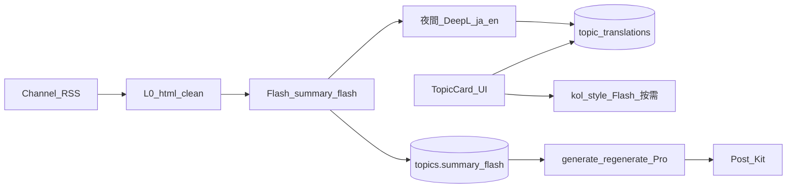

# 專案完整架構表（v8）

> **版本**：**v8.0.0-launch**（上架／正式域／生產設定演進 SoT）  
> **建立**：2026-07-29（自 **v7.0.0-code-freeze** `9556ea7` 分叉）  
> **更新日期**：2026-08-20（**源文章新聞報道全文翻譯管線**、主題卡事實錨定與 JIT 按需生成、5 道實體 Git Pre-Commit 硬門禁）  
> **分支**：正式域映像追 `main`（PR #39 image `6fa295d`、PR #38 dedup `4819e99`）  
> **v7 凍結（唯讀）**：tag `v7.0.0-code-freeze` · [docs/archives/v7.0.0_專案完整架構表_凍結.md](./docs/archives/v7.0.0_專案完整架構表_凍結.md) · [v7.0.0_CODE_FREEZE_MANIFEST.md](./docs/archives/v7.0.0_CODE_FREEZE_MANIFEST.md)  
> **版本政策**：[docs/VERSIONING_POLICY.md](./docs/VERSIONING_POLICY.md)  
> **上線 DNS**：[docs/alter_ego_launch_dns_checklist.md](./docs/alter_ego_launch_dns_checklist.md)  
> **產卡閘**：[docs/v8_collection_enable_preflight.md](./docs/v8_collection_enable_preflight.md)  
> **Observability**：[docs/v8_observability_alerting.md](./docs/v8_observability_alerting.md) · CX／OPS：[docs/v8_daily_ops_cx_checklist.md](./docs/v8_daily_ops_cx_checklist.md)  
> **日收備份**：[2026-08-20 源文章全文翻譯與事實錨定門禁](./docs/backups/2026-08-20_source-article-translation-and-guardrails_snapshot/SNAPSHOT_README.md) · [2026-08-12 Railway env／圖片搜尋](./docs/backups/2026-08-12_railway_env_image_ops_snapshot/SNAPSHOT_README.md) · [2026-08-11 topic HKT PR24](./docs/backups/2026-08-11_topic_dashboard_hkt_pr24_snapshot/SNAPSHOT_README.md) · [2026-08-11 ops digest](./docs/backups/2026-08-11_ops_digest_resend_pass_snapshot/SNAPSHOT_README.md)  
> **規則**：DNS／OAuth／生產 env／上架裁剪／線上熱修 **只改本檔與 v8 分支**；**禁止**覆寫 archives 內 v7 凍結副本。

---

## v8 相對 v7 的工作範圍（上架）

| 項目 | v7（凍結） | v8（2026-08-20 最新） |
|------|------------|------------------------|
| 程式基線 | `9556ea7` 已合 `main`（PR #17） | OBS＋PR #19 Resend＋PR #24 HKT＋PR #38/39 搜圖＋**事實錨定／源文章翻譯** |
| 測試 | 上架衝刺三日主路已過 | **正式域日常運作**（CX／OPS）；**5 道實體硬門禁 100% 守護** |
| 託管 | 未接 | **方案 B**：Vercel + Railway ✅ |
| DNS／OAuth | 未接 | 前端＋API DNS／health ✅；Resend 網域 Verified ✅ |
| 產卡 | 預設關 | **`ENABLE_SCHEDULED_TOPIC_COLLECTION=true`**（每日 **04:00 HKT** × 各 5 = **15**，`generate_content=false`） |
| Dashboard 今日卡 | UTC 日 filter（bug） | **HKT 營運日**（`topicDayHkt.ts`／`topic_day_hkt.py`） |
| 三語預載 | 按需 translate-display | **可選** `ENABLE_TOPIC_TRIPLE_PRELOAD`（DeepL en/ja 產後批次） |
| **源文章全文翻譯** | 僅 30 字摘要 | **`resolve_source_article_translation` 完整新聞報道翻譯**；DeepSeek Flash 新聞級譯文＋MongoDB `source_content_i18n` 快取＋前端即時中英對照 |
| **事實錨定與防污染** | 詞庫直塞 prompt | **規則 19 鐵律**：Soul/Article Prompt 事實錨定（Fact Grounding）與風格解耦（Anti-Pollution）；移除背景自動偷跑，嚴格按需出文 (JIT) |
| **主題詳情排版** | 舊版垂直堆疊 | **手繪草圖 1:1 重構**（頂部轉貼文章快捷滾動、大圖、源文章翻譯內容、中段左圖右文雙欄、150/300/500 黃金字數、底部 PostKit） |
| 登入 landing | My Channel | **Dashboard-first**（`VITE_POST_LOGIN_PATH` 可回滾） |
| 告警／日報 | 無 | Watchdog＋digest **正式運作**；digest 含 **今日產卡 N/15** |
| **圖片搜尋** | v6 本機 Google + 備援 | **Google Custom Search 必備**（Railway `GOOGLE_*`）；**DuckDuckGo 已移除**（PR #39）；v6 本機 key 在 `.env` **不會**自動上 Railway |
| **主題卡去重** | — | PR **#38**：補生成只填分類缺口；Dashboard 標題去重 |
| **實體硬門禁** | 手動測試 | **Git Pre-Commit 5 道實體門禁**（結構 + i18n 1092 鍵值 + 管線審計 + 語言單元測試 + 防線單元測試） |
| 文件 SoT | archives 凍結檔 | **本檔** |
| **上架判決** | — | **已上架營運**；OPS-DIGEST **PASS**；FIX-TOPIC **PR #24 merged** |
| 護城河 / GTM | 技術競爭（泛用） | **工作流/信任/反饋迴路 + 一站式低摩擦**；Google Ads **日本主場**、台港副；用實驗帳本認真營運；訂閱金流採 Stripe **自動訂閱**（B-auto） |

---


# 專案完整架構表（v7）

> **對外品牌**：**Alter Ego**  
> **網域**：**`ai-alterego.com`**（Spaceship；2026-06-02 購入）  
> **程式庫／文件舊稱**：Influencers AI Agents（漸進更名；上線 DNS 見 [`docs/alter_ego_launch_dns_checklist.md`](./docs/alter_ego_launch_dns_checklist.md)）  
> **版本**：**v7.0.0**（上架收斂版 · 規格 SoT）  
> **更新日期**：2026-07-28（Day3 Discover **summary_i18n** zh-TW／ja／en；備份 `2026-07-28_discover_summary_i18n`）  
> **狀態**：📋 v7 **架構 SoT**；**commit `bebf6d0`**（`feature/v7-cost-pipeline`）+ 本機 WIP **未全 commit**：Token／AE／MC／Discover **主路測試 ✅**；Discover feed **`lang=zh-TW|ja|en`**＋**`summary_i18n`**；~~**PF-S**~~ **廢止**  
> **觸發詞（上架衝刺 · 現用）**：`專案開始，先讀 docs/v7_program_line/_GATE.md 與 launch_test_sprint_2026-07-22.md 當日 Day，再開測 @AGENTS.md`  
> **測試 SoT**：[`docs/v7_program_line/launch_test_sprint_2026-07-22.md`](./docs/v7_program_line/launch_test_sprint_2026-07-22.md)  
> **文件備份**：[`docs/backups/2026-07-28_discover_summary_i18n/`](./docs/backups/2026-07-28_discover_summary_i18n/SNAPSHOT_README.md) · [`2026-07-22_day1_e0_ae1_snapshot`](./docs/backups/2026-07-22_day1_e0_ae1_snapshot/SNAPSHOT_README.md) · [`2026-07-21_launch-sprint-trigger_snapshot`](./docs/backups/2026-07-21_launch-sprint-trigger_snapshot/SNAPSHOT_README.md)  
> **日期 SoT**：**2026-07-28（星期二）** — 見 [`工作記錄.md`](./工作記錄.md) 頂部  
> **Discover**：**禁止** Node.js／PostgreSQL 主線／住宅 Proxy MVP；**唯一 Truth** = 現有 **FastAPI + MongoDB** 流水線擴充  
> **實作計畫**：`.cursor/plans/v7_token_省成本整合_050d25e8.plan.md`（與本檔同步）  
> **合併紀錄**：[PR #16](https://github.com/adamau1983119/AI_Agent_Webapp/pull/16) `docs/v7-spec-and-v6-freeze` → `main`  
> **v6 凍結（唯讀）**：[`專案完整架構表.md`](./專案完整架構表.md)、[`docs/archives/v6.0.0_專案完整架構表_凍結.md`](./docs/archives/v6.0.0_專案完整架構表_凍結.md)  
> **v7 需求**：[`docs/v7.0.0_需求文件.md`](./docs/v7.0.0_需求文件.md)  
> **版本政策**：[`docs/VERSIONING_POLICY.md`](./docs/VERSIONING_POLICY.md)

---

## 🏷️ 品牌與網域（Alter Ego）

| 項目 | 內容 |
|------|------|
| **對外品牌** | **Alter Ego** |
| **主網域** | **`ai-alterego.com`** |
| **註冊商** | Spaceship（自動續約至 2027-06-02） |
| **託管（定案）** | **B** — **Vercel**（前端）+ **Railway**（後端 · 專案 `alert-emotion` · 服務 `AI_Agent_Webapp`） |
| **前端正式域** | ✅ `https://ai-alterego.com`／`www`；`VITE_API_URL`→`https://api.ai-alterego.com/api/v1` |
| **API 正式域** | ✅ `https://api.ai-alterego.com`（CNAME→`a0nsx9p5.up.railway.app`；`/health` healthy／connected） |
| **API 備用 URL** | `https://aiagentwebapp-production.up.railway.app`（仍可用） |
| **本機開發** | 仍可用 `localhost:3000`／`8000`；與正式域 env **勿混用** |
| **上線 Checklist** | [`docs/alter_ego_launch_dns_checklist.md`](./docs/alter_ego_launch_dns_checklist.md) |
| **OAuth 衍生** | 後端 `GOOGLE_OAUTH_REDIRECT_URI` 已正式域；Google Console 白名單已加；正式域登入可用 |
| **產卡排程** | ✅ collection 開；`topic_generation.yaml` **daily 04:00 HKT** × 三類各 5 |
| **Observability** | ✅ Watchdog＋digest；**Resend HTTPS**；日報進信箱 **PASS**（2026-08-11） |
| **圖片搜尋（Topic 詳情）** | ✅ Railway 已設 `GOOGLE_API_KEY`＋`GOOGLE_SEARCH_ENGINE_ID`（2026-08-12）；API `ImageServiceManager` **Google 優先**（DuckDuckGo 已移除 · PR #39） |
| **上架判決** | **已上架營運** |
| **殘餘阻塞 ≤3** | ① 密鑰輪換（PD-OBS-TL-08）；② （可選）CX 煙霧；③ （可選）health timeout 誤報觀察 |

---

## 🖼️ 圖片搜尋（v6 對齊 · v8 正式域）

| 項目 | 內容 |
|------|------|
| **SoT 行為** | 主題詳情「搜尋圖片」→ **`GET /api/v1/images/search`** → **Google Custom Search**（`searchType=image`） |
| **必設 env** | `GOOGLE_API_KEY`、`GOOGLE_SEARCH_ENGINE_ID`（**本機 `backend/.env` 有 ≠ Railway 自動有**） |
| **備援（可選）** | `UNSPLASH_ACCESS_KEY`／`PEXELS_API_KEY`／`PIXABAY_API_KEY` |
| **已廢止** | DuckDuckGo 無 key 後備（PR **#39** merge `6fa295d`） |
| **驗收** | `/api/v1/validate/images` → `google_custom_search`；搜尋回 `source: Google Custom Search` |
| **範本** | [`backend/.env.railway.example`](./backend/.env.railway.example) |

---

## 📡 Observability／每日營運報告（v8 · 正式域）

| 項目 | 內容 |
|------|------|
| **正確行為** | Railway ≥**08:00 HKT** 自動寄日報到 `OBS_OPS_EMAIL`；綠燈也寄；紅燈另即時告警 |
| **程式路徑** | `ops_watchdog` → `daily_digest` → `alert_mailer` → **`EmailService`（Resend HTTPS 優先）** |
| **現況（2026-08-11）** | loop ✅；`Email 發送成功 (resend)` ✅；信箱已收；網域 Verified；From=`noreply@ai-alterego.com` |
| **正式解** | Resend（專家建議 ②）；**不作**本機排程／GHA 旁路 |
| **Checklist** | [`v8_observability_alerting.md`](./docs/v8_observability_alerting.md) · [`v8_daily_ops_cx_checklist.md`](./docs/v8_daily_ops_cx_checklist.md) **OPS-DIGEST PASS** |

---

## 📋 v7 與 v6 差異一覽

| 維度 | v6.0.0 | v7.0.0 |
|------|--------|--------|
| 目標 | 功能全集 + 測試週 | **上架 MVP + 成本可控** |
| 架構表 | `專案完整架構表.md`（凍結） | **本檔**（唯一演進） |
| 主題收集翻譯 | 可開 `ENABLE_AI_TOPIC_TRANSLATION` | **預設關**；standard 走 **DeepL**（非收集時 Flash） |
| 卡片翻譯 | 方案 C + DeepSeek `_translate_title` | **`topic_translations`** + DeepL standard；**kol_style** 僅按需 Flash |
| 排程 6h×3 | 文件描述為常態 | **預設關**；本機測試可開 → 改 **每日一次 × 三類各 5 張**（`topic_generation.yaml` `mode: daily`） |
| 長文生成模型 | 文件曾寫全站 Flash | **僅** generate/regenerate → **Pro**；其餘 **Flash**（D2） |
| 資料庫 | MongoDB topics | **+ `summary_flash`**、新 collection **`topic_translations`**（D1） |
| 導師模式 | 規格在案 | **UI 不承諾已上線** |
| AI 日誌 | 分散（model_used 等） | **`ai_generations`（規劃）** |
| PostgreSQL / NLLB | — | **禁止**（D1、D4） |
| 大眾免費主題卡（引流） | — | **Discover SKU**：8h RSS 批次、Redis→Mongo、`/discover` — **程式已實作**（CD-* 待測） |
| **MyChannel（v7.1）** | — | **登入預設 MyChannel**；專屬 feed + 點數解鎖 — **MC-1～6 ✅**（[`V7.1-SPEC.md`](./docs/V7.1-SPEC.md)）；CD → 上架衝刺 Day2 |
| **Alter Ego onboarding** | — | **範文 → DNA → Soul/Shell → Post Kit**；Flash-only AE 管線 — **AE-0～AE-2（程式）✅**；**E0-AE-1 ✅**；餘 E0／CD → Day1／3 |

---

## 🎯 v7 產品架構（邏輯視圖）

```
┌─────────────────────────────────────────────────────────────────────────┐
│                     Alter Ego v7.0（上架 MVP · ai-alterego.com）           │
│                                                                         │
│  ┌───────────────────────────────────────────────────────────────────┐ │
│  │  P0 主路（對外）                                                   │ │
│  │  登入 → 頻道(RSS≤10) → 收集(L0) → summary_flash(Flash一次)         │ │
│  │       → 主題卡(DeepL standard 快取) → 詳情生成(Pro，僅此出口)        │ │
│  │       → Post Kit 複製發文                                          │ │
│  └───────────────────────────────────────────────────────────────────┘ │
│  ┌───────────────────────────────────────────────────────────────────┐ │
│  │  Alter Ego onboarding（Post Kit 後 · 疊加層 · **AE-1a/b 部分 ✅**）      │ │
│  │  首登 pending → 範文 extract(Flash) → alter_ego_dna + snapshot     │ │
│  │       → Soul(Flash+DNA) → Shell(YAML: FB/Threads/X) → Post Kit     │ │
│  │  Skip → MyChannel；generate(Pro) 可读 compressed DNA + version_id   │ │
│  └───────────────────────────────────────────────────────────────────┘ │
│  ┌───────────────────────────────────────────────────────────────────┐ │
│  │  P1 可選／Beta                                                     │ │
│  │  靈感助手(Flash+CostMonitor) · Meta 連線 · Publish                 │ │
│  └───────────────────────────────────────────────────────────────────┘ │
│  ┌───────────────────────────────────────────────────────────────────┐ │
│  │  P2 隱藏／關閉（程式保留）                                         │ │
│  │  排程展示 · 主打三類自動收集 · 導師模式 · Style Profile · generate-today │ │
│  └───────────────────────────────────────────────────────────────────┘ │
│  ┌───────────────────────────────────────────────────────────────────┐ │
│  │  引流（Discover SKU · 已實作程式）                                   │ │
│  │  8h RSS 批次 → Flash 骨(summary_flash) → DeepL 皮(≤20字) → Mongo+Redis │ │
│  │  GET /public/topics/feed · 前端 /discover · 讀取 **0 LLM**          │ │
│  └───────────────────────────────────────────────────────────────────┘ │
│                                                                         │
│  ┌───────────────────────────────────────────────────────────────────┐ │
│  │  AI 分層                                                           │ │
│  │  L0 零元清洗 │ Flash 提煉 summary │ DeepL standard │ kol=Flash 按需   │ │
│  │  生成=Pro（僅 /contents/generate·regenerate）                        │ │
│  └───────────────────────────────────────────────────────────────────┘ │
└─────────────────────────────────────────────────────────────────────────┘
```

---

## 🛣️ 前端路由（v7 可見性）

> **實作檔**：`frontend/src/app/App.tsx`、`frontend/src/components/layout/Sidebar.tsx`  
> **v7 Sidebar**：`v7_nav` 過濾 **已實作**（2026-06-10 Phase A）

| 路徑 | 元件 | v7_nav | 說明 |
|------|------|:------:|------|
| `/` | RootRedirect | — | token→**pending? onboarding : Dashboard**；无语言→`/language`；未登入→**`/welcome`** |
| `/onboarding/alter-ego` | AlterEgoOnboarding | **顯示** | 首登范文；含 **Skip** → **`/dashboard`**（v8 PR #24） |
| `/language` | LanguageSelection | 公開 | |
| `/login` … `/privacy` | 認證／靜態 | 公開 | 同 v6 |
| `/my-channel` | MyChannel | **顯示** | 專屬 feed + 點數解鎖（MC-1～6）；**非**預設 landing |
| `/dashboard` | Dashboard | **顯示** | **v8 登入預設首屏**；今日主題 **HKT N/15**（`topicDayHkt.ts`） |
| `/topics` | Topics | **顯示** | |
| `/topics/:id` | TopicDetail | **顯示** | 含 translate-display、生成內容、**Post Kit**（`PostKitPanel`） |
| `/channels` | Channels | **顯示** | |
| `/channels/create` | CreateChannel | **顯示** | 助手優先（v6 已落地） |
| `/channels/:id` | ChannelDetail | **顯示** | collect、topics |
| `/channels/:id/edit` | ChannelEdit | **顯示** | |
| `/inspiration` | Inspiration | **顯示** | 不提導師已上線 |
| `/preferences` | Preferences | **顯示** | |
| `/settings` | Settings | **顯示** | Header 選單 |
| `/schedule` | Schedule | **隱藏** | v7 無排程承諾 |
| `/style-profile` | StyleProfile | **隱藏** | |
| `/social-connect` | SocialConnect | **Beta** | |
| `/publish` | Publish | **Beta** | L0 **發布助手**（預設無 API 代發）；`VITE_ENABLE_API_PUBLISH=true` 才顯示舊代發 |
| `/welcome` | Welcome | **引流** | Landing 行銷導流 ✅（`Welcome.tsx`；i18n `landing.*`；testid 頻道區塊 2.0） |
| `/discover` | Discover | **引流** | 探索／導入；**非**登入預設；**僅** `GET …/public/topics/feed` |

---

## 🔐 Token 省成本 — 客戶五項鎖定決策（2026-06-05 · 開發鐵律）

> **來源**：第三方「架構式蒸餾」規格對照；**已決案**，實作與 Code Review 以本節為準。  
> **禁止**：PostgreSQL 遷移、SQL/SQLAlchemy、NLLB-200、半夜 kol_style、全文進 LLM prompt。

### D1 資料庫：100% MongoDB 擴充

| 規則 | 內容 |
|------|------|
| 拒絕 | 遷移 PostgreSQL；第三方 `schema.sql` **不落地**，改映射 Mongo |
| `topics` | 新增 **`summary_flash: str`**（約 300 字；**唯一**進長文 LLM 的事實源） |
| 新 Collection | **`topic_translations`** |
| 索引 | **Motor** `create_index`：**`(topic_id, lang, type)` Unique Compound** |
| `type` | `standard_translation`（DeepL）｜`kol_style`（Flash，僅按需） |
| 相容讀取 | 先查 `topic_translations` → fallback `titles_i18n` |

**文檔形狀（規劃）**

```text
topic_translations: {
  topic_id, lang: zh-TW|en|ja,
  type: standard_translation|kol_style,
  cached_title, cached_content,
  provider: deepl|deepseek_flash|fallback,
  created_at, updated_at
}
```

冷存全文：沿用 `sources[].original_content`；**禁止**進任何 LLM prompt。

### D2 模型路由：混合分層

| 呼叫場景 | 模型／工具 |
|----------|------------|
| HTML 清洗、RSS 抓取 | **0 元**（爬蟲／extractor） |
| `summary_flash` 提煉、過濾、**kol_style** 改寫 | **`deepseek-v4-flash`**（`DEEPSEEK_MODEL_FLASH`） |
| standard 翻譯（卡片／預載） | **DeepL API** |
| **`POST /api/v1/contents/{topic_id}/generate`** | **`deepseek-v4-pro`**（`DEEPSEEK_MODEL_PRO`） |
| **`POST …/regenerate`** | 同上 **Pro** |

`.env` **必須**區分 `DEEPSEEK_MODEL_FLASH` 與 `DEEPSEEK_MODEL_PRO`；generate/regenerate **不得**沿用 Flash 預設。

### D3 背景排程：Channel 定向夜間預載

| 禁止 | 允許 |
|------|------|
| 每 6h `collect_fashion/food/trend` 三類全面收集 | **僅**指定 **港日媒體 Channel RSS** 定時抓取 |
| 收集管線內 AI 翻譯、半夜 **kol_style** | 流水線：**L0 清洗 → Flash `summary_flash` → DeepL 預載 `ja`+`en` `standard_translation` → 寫 `topic_translations`** |
| | **kol_style** 僅用戶進站點擊時觸發 |

| 環境變數 | 建議 |
|----------|------|
| `ENABLE_SCHEDULED_TOPIC_COLLECTION` | `false`（舊三類） |
| `ENABLE_CHANNEL_PREFETCH_PIPELINE` | `true`（**規劃**；定向 job） |

實作檔：`backend/app/services/automation/scheduler.py`（新 job，非重開三類）。

### D4 降級：P0 僅字串 Fallback

- DeepL **5 秒**硬超時或 API 錯誤 → 回傳 `"[Fallback-JA] " + summary_flash` 或 `"[Fallback-EN] " + …`
- 日誌前綴：`[TRANSLATION_FALLBACK_TRIGGERED]`
- **不做** NLLB、自架小模型

規劃模組：`backend/app/services/translation/deepl_provider.py`（`translate_with_fallback`）。

### D5 Prompt：短文本斷流（不強制 API Context Cache）

- **不實作** DeepSeek prefix caching 控制邏輯
- **SYSTEM_PROMPT** 固化為靜態常數、極簡
- 所有 Flash／**Pro 產文**輸入以 **`summary_flash`（~300 字）** 為主；**禁止** `original_content`／HTML 進 prompt
- 目標：input token 物理降約 **90%**（與官方是否命中 cache 無關）

### 目標資料流（SoT）



### 實作階段與驗收（對照計畫）

> **工作明細 + 可勾選檢查清單（追查／檢修用）**：[`docs/v7_program_line/_completed/token_cost.md`](./docs/v7_program_line/_completed/token_cost.md)（**Completed**；舊路径 [`v7_token_cost_phase_checklist.md`](./docs/v7_token_cost_phase_checklist.md) 為轉址）  
> **本機驗收（:8000 / :3000 · 截圖為證，不變）**：[`docs/v7_evidence_screenshot_guide.md`](./docs/v7_evidence_screenshot_guide.md)  
> **本機監控（Loguru · CTO 鎖定）**：[`docs/v7_dev_monitoring_discipline.md`](./docs/v7_dev_monitoring_discipline.md) — `log_cost_event`；禁 pino；v7 新檔 ≤150 行

| Phase | 內容 | 必過檢查（摘要） | 狀態 |
|-------|------|------------------|------|
| 0 | env 基線、`/health` cost_controls、Token 對照 | C0-1、C0-2、C0-4 | **程式** ✅；C* 手測 ⏳ |
| 1 | `summary_flash`、prompt 斷流、Pro/Flash 路由 | C1-1、C1-2、C1-3、C1-5、C1-7 | **程式** ✅；C* ⏳ |
| 2 | `topic_translations`、DeepL、定向夜間預載 | C2-1、C2-3、C2-5、C2-6、C2-7、C2-8 | **程式** ✅；C* ⏳ |
| 3 | token gateway、`max_tokens` 1500 | C3-1、C3-2、C3-3、C3-5 | **程式** ✅；C* ⏳ |
| 4 | TopicCard skeleton/fade、cache 體感 | C4-1、C4-2、C4-4 | **程式** ✅；C* ⏳ |
| 5 | 法務合規（非程式） | P5-01～02 | **程式** 頻道區塊 7 ✅；法務覆核 ⏳ |
| **跨 Phase** | 上線前總驗收 | X-1～X-6 | **06-19** 匯總 |
| **Discover SKU** | 大眾免費主題卡（見下節） | CD-0～CD-X + **PF-H/B/M**（[`v7_discover_public_feed_checklist.md`](./docs/v7_discover_public_feed_checklist.md)） | **PD-0～4 + PD-H/B/M** ✅；**CD-*** → 上架衝刺 Day3 |
| **MyChannel SKU** | 登入預設 + 點數解鎖（頻道區塊 13） | **MC-1～MC-6** ✅ | CD → Day2；[`v7_mychannel_checklist.md`](./docs/v7_mychannel_checklist.md) |
| **Alter Ego SKU** | Onboarding + Soul/Shell（頻道區塊 14） | **AE-0～AE-2** 程式 ✅ | CD／E0 → Day1／3；[`v7_alter_ego_checklist.md`](./docs/v7_alter_ego_checklist.md) |

---

## 🌐 大眾免費主題卡（Discover SKU · 2026-06-05 鎖定）

> **產品定位**：跨文化、跨語言靈感破繭器；**即時動態牆**供港日自媒體以**母語（繁中／日文）**瀏覽，作引流門面。  
> **架構評審**：**嚴禁**照抄第三方簡報之 **Node.js + PostgreSQL + 住宅 Proxy**；本 SKU **唯一 Truth** = **現有 Python/FastAPI + MongoDB** 流水線擴充。  
> **實作順序（2026-07-21 修訂）**：**VM → Token 0～5 → Discover PF-* → Landing → Post Kit → AE-0～AE-2 ✅ → MyChannel MC-1～6 ✅ → 上架衝刺測試（07-22～24）**。詳見 [`docs/v7_program_line/index.md`](./docs/v7_program_line/index.md) + [`launch_test_sprint_2026-07-22.md`](./docs/v7_program_line/launch_test_sprint_2026-07-22.md)。
> **不與**付費詳情 **Pro generate** 搶同一排程與模型出口。

### 四條鋼鐵修正案（PR 拒絕條件）

| # | 判決 | 開發鐵律 |
|---|------|----------|
| **P1** | **後端與 DB 物理死鎖** | 批量 Worker **100%** 擴充 [`backend/app/services/automation/scheduler.py`](./backend/app/services/automation/scheduler.py)；**禁止** Node 執行期。**100% MongoDB**（`topics` 擴欄或 `public_topics_feed` collection）。**禁止** SQL／SQLAlchemy／PostgreSQL 連線 → **PR 直接失敗**。 |
| **P2** | **爬蟲降維** | **MVP 僅 RSS + 白名單媒體**（沿用 `FeedHealthService`）。**禁止** MVP 必達 Puppeteer／Playwright／**住宅 Proxy Pool**（預算項 **Proxy = 0**）。特定媒體強爬僅允許**後續**獨立 Python Helper **PASS/FAIL 試點**。 |
| **P3** | **快取防白屏** | `GET /api/v1/public/topics/feed`：**Redis 熱資料優先 → Mongo 36h 冷備 fallback**。Redis 掛載仍須可讀（允許較慢）；**SoT = MongoDB**，Redis 僅加速。 |
| **P4** | **數量／熔斷／預算** | 常數寫死於 `config_module.py`（防工程漂移）。DeepL 標題 **≤20 字**；**`MAX_TRANSLATION_RETRIES = 3`**（單卡單語），逾限 → D4 字串 Fallback + `TRANSLATION_FALLBACK_TRIGGERED`。成本拆列：**DeepSeek｜DeepL｜主機｜Redis**；**嚴禁**付費代理 API。 |

### 數量公式（config 必備）

| 常數（規劃名） | 值 | 說明 |
|----------------|-----|------|
| `PUBLIC_FEED_BATCH_SIZE` | `30` | 每批次卡片數 |
| `PUBLIC_FEED_INTERVAL_HOURS` | `8` | 排程間隔（例：00:00 / 08:00 / 16:00 HKT） |
| `PUBLIC_FEED_WINDOW_HOURS` | `36` | 滾動視窗 |
| `PUBLIC_FEED_MAX_CARDS` | `135` | \(30 \times (36/8)\)；可由前三者計算並 assert |

### 管線（SKU 變體 · 與付費主路分離）

```text
[排程 8h · ENABLE_PUBLIC_FEED_PIPELINE]
       │
       ▼
[Python RSS + Feed Health · 0 元抓取]  ← 禁止收集管線 ENABLE_AI_TOPIC_TRANSLATION
       │
       ├──► [Flash] summary_flash + 多語 JSON（骨）  ← 對齊 Phase 1；公共批次僅 Flash
       │
       └──► [DeepL] 標題 ≤20 字 zh/ja（皮）  ← 對齊 Phase 2 deepl_provider；熔斷 3 次
       │
       ▼
[寫入 Mongo SoT] ──► [Redis 熱快取 · TTL ≤ 36h]
       │
       ▼
[GET /api/v1/public/topics/feed?lang=ja|zh-TW]  ← 讀取路徑禁止觸發 LLM
       │
       ▼
[前端 /discover]  ← 初次載入：Network 無 assist/generate；LLM 消耗 = 0
```

**與 D2/D3 分界**：公共 SKU **禁止 Pro**；**不共用** `POST /contents/.../generate`、**不共用** 用戶頻道 `collect` 之逐則翻譯；舊 **6h 三類主打** 保持 **關**（`ENABLE_SCHEDULED_TOPIC_COLLECTION=false`）。

### 入庫與讀取（已實作 · 2026-06-12）

| 項目 | 規格 |
|------|------|
| **Topic 擴欄** | `source_lang`、`public_feed_flag`、`titles_i18n`、**`summary_i18n`**（zh-TW／ja／en）；索引 `(public_feed_flag, created_at)` |
| **讀取 API** | `GET /api/v1/public/topics/feed?lang=ja\|zh-TW` → `public_topics.py` |
| **現有 `discover.py`** | 仍為**觸發收集**；公共牆用 **`public_topics`** + 前端 **`/discover`** |
| **混合分流** | **皮**：`deepl_title` ≤20 字；**骨**：`summary_flash`；**禁止** `original_content` 進 prompt（D5） |

### 環境開關（已實作 · 與 cost_controls 對齊）

| 變數 | 建議 | 說明 |
|------|------|------|
| `ENVIRONMENT` | `development`／`staging`／`production` | 分流依據（**非** `core/` 路徑） |
| `ENABLE_PUBLIC_FEED_PIPELINE` | `false`（dev）；staging／prod 審核後 `true` | 與 `ENABLE_CHANNEL_PREFETCH_PIPELINE` **分開** |
| `ENABLE_SCHEDULED_TOPIC_COLLECTION` | `false` | 舊三類 6h **不**與公共 8h 混用 |
| `MAX_TRANSLATION_RETRIES` | `3` | Discover 標題 DeepL 熔斷（**熔斷三閘** 之二） |

`GET /health` → `cost_controls` 含 `public_feed_pipeline`、`safe_batch_size`、`public_feed_batch_size`（**重啟 uvicorn** 後可見；`bebf6d0`）。

### Redis 熱快取（語系拆分 · 已實作 · PF-3）

| 項目 | 實作 |
|------|------|
| **檔案** | [`public_feed_cache.py`](./backend/app/services/public_feed/public_feed_cache.py) |
| **Redis Key** | `public_feed:feed:zh-TW`、`public_feed:feed:ja`、`public_feed:feed:en` |
| **值** | **JSON 字串**（`json.dumps(cards)`）；**禁止** pickle |
| **TTL** | `PUBLIC_FEED_WINDOW_HOURS`（36h） |
| **寫入** | `refresh_feed_cache(topics)` → 依語系 `topics_to_feed_cards` 各寫一鍵（**僅**真實批次管線） |
| ~~**PF-S**~~ | ~~Mock 腳本~~ **廢止** — 禁止假 topics 充 feed |

### 環境分流與熔斷三閘（PF-H · 已實作 · `bebf6d0`）

> 分流鍵：**`ENVIRONMENT`**（非 `APP_ENV`）。

| 閘 | 規則 | 落點 |
|----|------|------|
| **批次總量** | `safe_batch_size`；迴圈硬 break | `config_module` + `public_feed_pipeline.py` |
| **DeepL 三遍** | retries ≤ 3 → Fallback | `deepl_title.py` |
| **讀取隔離** | feed 零 LLM import | `public_topics.py` |

| 環境 | `ENABLE_PUBLIC_FEED_PIPELINE` | `safe_batch_size` | 8h Cron |
|------|------------------------------|-------------------|---------|
| **development** | **false**（預設） | **一律 2**（含 CLI 手動）+ `PUBLIC_FEED_DEV_CAP` log | **不註冊** |
| **staging** | 審核後 `true` | **30** | 可開；**須**人工 + **DT-5** |
| **production** | 審核後 `true` | **30** | 8h；**須 DT-5** |

**營運邊界**：程式無法阻擋 staging／prod 手滑真跑 30 批 → **DT-5** 每日預算告警 + 雙軌驗收紀律。

### 港日同質（PF-B · 驗收定義）

| 層 | MVP | 讀取 |
|----|-----|------|
| **皮（標題）** | 批次預寫 `topic_translations`（`standard_translation`）**zh-TW + ja**；**en** 用 `topics.title` | `/discover` Network **翻譯 API = 0** |
| **骨（內文）** | canonical `summary_flash`（繁中 Flash）；顯示用 **`summary_i18n`／`cached_content`**（zh-TW／ja／en） | `GET …/feed?lang=` 零 LLM |
| **驗收** | **E0-Discover-i18n**：zh-TW／ja（＋en）各變；Network 翻譯 API **= 0** | 見 checklist；備份 `docs/backups/2026-07-28_discover_summary_i18n/` |

### v7.1 伏筆欄位（PF-M · 僅 schema）

| 欄位 | 用途 | MVP |
|------|------|-----|
| `source_country` | 來源國別（港日同質標記） | 入庫預設；**無**分析 job |
| `is_trend_alert` | Trend Alert 變現旗標 | 預設 `false`；邏輯見 [`v7.1_ROADMAP.md`](./docs/v7.1_ROADMAP.md) |

### 驗收（Discover · 工作明細全文）

> **可勾選清單（PD-* 工作項、CD-* 檢查項、`[ ]`/`[x]`/`[!]`）**：[`docs/v7_discover_public_feed_checklist.md`](./docs/v7_discover_public_feed_checklist.md)  
> 下表僅摘要；**禁止**僅勾下表而不跑 checklist。

| 代號 | 必過（摘要） | 對照 checklist |
|------|--------------|----------------|
| PF-1 | 8h job 僅 RSS | CD-2-7、CD-X-1 |
| PF-2 | 批次 30、窗內 ≤135 | CD-2-1、CD-2-6 |
| PF-3 | Redis 掛 → Mongo 仍 200 | CD-3-2 |
| PF-4 | `/discover` 0 LLM | CD-4-2 |
| PF-5 | log_cost_event 三類 tag | CD-2-2、CD-2-3 |
| PF-6 | 無 Node/SQL/Proxy | CD-1-1、CD-1-2 |
| **PF-H** | 熔斷三閘 + `safe_batch_size` + dev 禁 cron（**PD ✅**） | CD-H-1～CD-H-4 |
| ~~**PF-S**~~ | ~~Mock 腳本~~ | ❌ **廢止 2026-06-16** |
| **PF-B** | 批次預寫 zh-TW+ja `topic_translations` | CD-B-1～CD-B-3、**E0-Discover-i18n** |
| **PF-M** | `source_country`、`is_trend_alert` metadata | CD-M-1～CD-M-2 |

> **變現路線圖**：[`docs/v7.1_ROADMAP.md`](./docs/v7.1_ROADMAP.md)（Trend Alert、KOL Copilot、白皮書、時空膠囊）— **不阻** Discover MVP。

### 落地時程（概念 · 4～6 週）

1. **前置**：VM 週 + Phase 1 `summary_flash` + Phase 2 `deepl_provider`  
2. **Week A**：`config_module` 常數 + `scheduler.py` 公共 job 骨架（開關預設 off）  
3. **Week B**：批次寫 Mongo + Redis + `GET .../feed`  
4. **Week C**：前端 `/discover` 只讀 + 截圖驗收（[`v7_evidence_screenshot_guide.md`](./docs/v7_evidence_screenshot_guide.md)）  

**Cursor 任務摘要（實作時貼用）**：在 FastAPI 擴充公共路由與 8h 排程；入庫擴欄；feed 讀 Redis→Mongo；標題 DeepL、內文 `summary_flash`；驗收以終端 `log_cost_event` + 前端 **0 LLM** 為準。

---

## 📺 MyChannel SKU（我的頻道 · v7.1 · 2026-06-16）

> **規格 SoT**：[`docs/V7.1-SPEC.md`](./docs/V7.1-SPEC.md)  
> **Checklist**：[`docs/v7_mychannel_checklist.md`](./docs/v7_mychannel_checklist.md)  
> **備份（2026-06-25）**：[`docs/backups/2026-06-25_f05-mychannel-program_snapshot/`](./docs/backups/2026-06-25_f05-mychannel-program_snapshot/SNAPSHOT_README.md)
> **備份（2026-06-25）**：[`docs/backups/2026-06-25_f05-mychannel-program_snapshot/`](./docs/backups/2026-06-25_f05-mychannel-program_snapshot/SNAPSHOT_README.md)
> **需求**：[`docs/v7.0.0_需求文件.md`](./docs/v7.0.0_需求文件.md) 頻道區塊 13  
> **與 Discover 分界**：**禁止**共用 `public_feed:feed:*` 與 `run_public_feed_batch`

### 產品定位

| 維度 | 規格 |
|------|------|
| **登入首屏** | **MyChannel**（非 Discover） |
| **Discover** | 探索／導流；無頻道用戶 **不**灌公共牆 → 推 **熱門頻道模板** |
| **免費層** | Heading + ≤30 字簡介（**無**可點 URL） |
| **解鎖 1 點** | `source_url` + `digest_300` |
| **初始點數** | **5 點**（MVP 無金流；AddPoints 管理端） |

### MC 工程鐵律（摘要）

**MC-1** 沒 URL 不出卡 · **MC-2** 登入不 collect／LLM · **MC-3** 空 RSS 不 AI 補題 · **MC-4** Redis 隔離 · **MC-5** 先扣點 · **MC-6** 禁止 Mock · **MC-7** 24h 組裝 ≤3 次

### Redis 與 API（已實作 · 2026-06-25）

| 項目 | Public Discover | MyChannel |
|------|-----------------|-----------|
| **Redis key** | `public_feed:feed:{lang}` | `my_channel:feed:{user_id}:{lang}` |
| **Feed GET** | `/api/v1/public/topics/feed` | `/api/v1/my-channel/feed` |
| **Unlock** | — | `POST …/my-channel/topics/{id}/unlock` |
| **AddPoints** | — | `POST …/admin/users/{id}/credits`（admin） |
| **批次** | `public_feed_batch` | **僅** channel collect（**禁止** public batch） |

### Phase 對照（MC-*）

| 代號 | 必過 | Checklist | 狀態 |
|------|------|-----------|------|
| **MC-1** | Redis 帳本 + 5 點 + AddPoints | CD-MC1-* | ✅ PD；CD → Day2 |
| **MC-2** | feed 組裝（免費層） | CD-MC2-* | ✅ PD；CD → Day2 |
| **MC-3** | unlock 1 點 | CD-MC3-* | ✅ PD；CD → Day2 |
| **MC-4** | 前端首屏 + 登入 redirect | CD-MC4-* | ✅ PD；CD → Day2 |
| **MC-5** | Step 10–12 防禦 | CD-MC5-* | ✅ PD；CD → Day2 |
| **MC-6** | 熱門頻道模板 | CD-MC4-*（餘裕） | ✅ PD（2026-07-21） |
| **MC-6** | 熱門模板（P1） | 待訂 | ⏳ |

### 目錄（已實作）

```text
backend/app/services/credit_ledger_service.py
backend/app/services/my_channel/
  my_channel_cache.py
  my_channel_service.py
backend/app/schemas/my_channel.py
backend/app/api/v1/my_channel.py          # feed + unlock + admin credits
frontend/src/pages/MyChannel.tsx
frontend/src/api/myChannel.ts
scripts/check_mychannel_bf_static.py      # 16/16 PASS
```

---

## 🎭 Alter Ego SKU（數位副本 · Onboarding · v7.2 規格 · 2026-07-22 更新）

> **需求**：[`docs/v7.0.0_需求文件.md`](./docs/v7.0.0_需求文件.md) 頻道區塊 14  
> **Checklist**：[`docs/v7_alter_ego_checklist.md`](./docs/v7_alter_ego_checklist.md)  
> **規格（AE-0 ✅）**：[`docs/ALTER_EGO_SPEC.md`](./docs/ALTER_EGO_SPEC.md)  
> **備份（2026-06-17）**：[`docs/backups/2026-06-17_alter-ego-architecture_snapshot/`](./docs/backups/2026-06-17_alter-ego-architecture_snapshot/SNAPSHOT_README.md)  
> **備份（2026-06-24）**：[`docs/backups/2026-06-24_ae-preview-pipeline_snapshot/`](./docs/backups/2026-06-24_ae-preview-pipeline_snapshot/SNAPSHOT_README.md) — preview + `pipeline_version` + dev `--reload`  
> **備份（2026-06-25）**：[`docs/backups/2026-06-25_f05-mychannel-program_snapshot/`](./docs/backups/2026-06-25_f05-mychannel-program_snapshot/SNAPSHOT_README.md) — F05～F07 + MC-1～5  
> **備份（2026-07-22）**：[`docs/backups/2026-07-22_day1_e0_ae1_snapshot/`](./docs/backups/2026-07-22_day1_e0_ae1_snapshot/SNAPSHOT_README.md) — Day1 **E0-AE-1** + client timeout 120s  
> **與 Discover／MyChannel**：**獨立 SKU**；不讀寫 `public_feed:*`、`my_channel:feed:*`（讀寫僅限各自模組）  
> **執行順序**：**PF-B → PF-M → Landing → Post Kit → AE-0 → AE-1d ✅**  
> **結案 Python**：`check_ae_bf_static.py`（**30/30**）、`check_ae_bf_ui.py`（**22/22**）、`check_ae_live.py`（extract + preview + rollback **200**）

### 實作狀態（2026-07-22）

| 區塊 | 狀態 | 證據 |
|------|------|------|
| **AE-0** 規格 + Shell YAML + Pydantic | ✅ | `ALTER_EGO_SPEC.md`；PD-AE0-01～07 |
| **AE-1a** extract + Mongo snapshot | ✅ | `POST /alter-ego/extract`；`check_ae_live.py` |
| **AE-1b** ShellManager + Soul/Shell preview | ✅ | `shells/`；`POST /alter-ego/preview` |
| **AE-1c** ContentStyleService + generate meta | ✅ | `content_style_service.py`；`generation_meta.dna_version_id` |
| **AE-1d** BodyGateway + onboarding + Post Kit 平台 | ✅ | `AlterEgoOnboarding.tsx`；`PostKitPanel` F05～F07 |
| **pipeline_version** 防 stale | ✅ | `AE_PIPELINE_VERSION=5` → `/health`；`ensure_backend_fresh.py` |
| **E0-AE-1** 手測主路 | ✅ | pending → extract 200 → active → `/my-channel`；`docs/evidence/v7/2026-07-22/` |
| **前端 timeout** | ✅ | `alterEgo.ts` extract／preview **120s**（預設 10s 不足） |

### 產品一句

**1～3 篇範文 → Flash extract → Mongo DNA → Soul(Flash) → Shell(YAML) → Post Kit 複製**；首登可 **Skip** 直進 MyChannel。

### 架構已決議（2026-06-17）

| 維度 | 決策 |
|------|------|
| **LLM** | AE 全路徑 **Flash-only**；`generate/regenerate` 仍 **Pro**（分路由） |
| **ContentStyleService** | `resolve_for_route(user_id, route)` → `StyleContext`；**唯一**风格入口 |
| **dna_status** | `pending` \| `active` \| `skipped` \| `legacy_only` |
| **version_tag** | `current_dna_version_id` + snapshots；`generation_meta.dna_version_id` |
| **雙層防禦** | Router（`AlterEgoBodyGateway`）+ Factory（`namespace=alter_ego` assert Flash） |
| **style_profiles** | AE `active` 后停止双写；legacy 过渡 `legacy_only` |
| **護城河 MVP** | DNA JSON + exemplar + 週 batch Flash patch；**无 fine-tune** |

### 管線

```text
[首登 pending 或 助手贴范文]
       │
       ▼
POST /alter-ego/extract (Flash + Pydantic strict)
       │
       ▼
alter_ego_dna + alter_ego_dna_snapshots (bump version_id)
       │
       ├── preview: Soul(Flash+DNA) → ShellManager(YAML) → 仿文卡
       │
       └── v7 主路: contents/generate (Pro) ← ContentStyleService compressed DNA + dna_version_id
       │
       ▼
Post Kit（平台切换 FB/Threads/X + Visual Prompt）
```

### Phase 對照（AE-*）

| 代號 | 必過 | Checklist | 狀態 |
|------|------|-----------|------|
| **AE-0** | 規格 + 架構決議入庫 | PD-AE0-* | ✅ |
| **AE-1a** | extract + preview + collections | CD-AE-A | ✅ 程式；人工／衝刺 |
| **AE-1b** | ShellManager + YAML | CD-AE-B | ✅ 程式 |
| **AE-1c** | ContentStyleService + generate meta | CD-AE-C | ✅ PD；**Day1** |
| **AE-1d** | onboarding + Skip + Post Kit 切换 | E0-AE-* | ✅ PD；**E0-AE-1 ✅**；E0-AE-2／3 ⏳ |
| **AE-2** | feedback + weekly batch + re-extract | PD-AE2-03 | ✅ 01/02/04；**03 → Day3** |
| **AE-2** | 週 batch + rollback | PD-AE2-* | ⏳ |

### API

| 路徑 | 模型 | 說明 | 狀態 |
|------|------|------|------|
| `POST /api/v1/alter-ego/extract` | Flash | 範文 → DNA JSON | ✅ |
| `POST /api/v1/alter-ego/preview` | Flash | Soul + Shell 仿文 | ✅ |
| `GET /api/v1/alter-ego/status` | — | DNA 狀態查詢 | ✅ |
| `POST /api/v1/alter-ego/skip` | — | Skip onboarding | ✅ |
| `POST /api/v1/alter-ego/dna/rollback` | — | 還原 snapshot | ✅ |
| `POST /api/v1/alter-ego/adopt-copy` | — | Post Kit 一鍵採用 audit | ✅ |
| `POST /api/v1/contents/{id}/generate` | **Pro** | 可读 DNA；写 `dna_version_id` | ✅ |
| `GET /api/v1/my-channel/feed` | — | 免費層 feed（無 URL） | ✅ |
| `POST /api/v1/my-channel/topics/{id}/unlock` | — | 扣 1 點 → URL + digest | ✅ |
| `POST /api/v1/admin/users/{id}/credits` | — | AddPoints（admin） | ✅ |

### 目錄（實作標註）

```text
backend/app/alter_ego_build.py                    # AE_PIPELINE_VERSION ✅
backend/app/services/alter_ego_service.py         # extract + preview ✅
backend/app/services/alter_ego_health.py          # /health payload ✅
backend/app/services/ai/llm_factory.py              # AlterEgoLLMClient ✅
backend/app/services/shells/                      # ShellManager + formatter ✅
backend/app/services/repositories/alter_ego_repository.py  # Mongo ✅
backend/app/models/alter_ego_dna.py               # Pydantic DNA ✅
backend/app/schemas/alter_ego.py                  # API schemas ✅
backend/app/api/v1/alter_ego.py                   # extract/preview/skip/rollback/adopt ✅
backend/app/services/content_style_service.py     # ContentStyleService ✅
backend/app/middleware/alter_ego_body_gateway.py  # BodyGateway ✅
backend/app/api/v1/my_channel.py                  # feed + unlock + admin credits ✅
backend/app/services/credit_ledger_service.py     # 點數帳本 ✅
backend/app/services/my_channel/                  # cache + feed ✅
scripts/check_ae_bf_static.py                     # 30/30 ✅
scripts/check_ae_bf_ui.py                         # 22/22 ✅
scripts/check_ae_live.py                          # extract + preview + rollback ✅
scripts/check_mychannel_bf_static.py              # 16/16 ✅
frontend/src/pages/AlterEgoOnboarding.tsx         # onboarding UI ✅
frontend/src/components/features/PostKitPanel.tsx # F05 平台切换 ✅
frontend/src/pages/MyChannel.tsx                  # MC-4 feed ✅
```

---

## 🤖 AI 與成本架構（v7 SoT）

### 呼叫路徑

```
                    ┌─────────────────┐
                    │  AIServiceFactory│
                    └────────┬────────┘
                             │
         ┌───────────────────┼───────────────────┐
         ▼                   ▼                   ▼
  topic_collector      topic_display_         contents.py
  _translate_title     translation_service    generate/regenerate
  channel_collector         │                      │
         │                  │                      │
         │            DeepL + topic_translations     │
         │            kol_style=Flash 按需            │
         ▼                  ▼                      ▼
   L0: 關閉=原文      standard 快取           DeepSeek **Pro**
   (ENABLE_AI_       (ja/en 夜間預載)         （僅 generate/
    TOPIC_TRANSLATION                              regenerate）
    =false)              alter-ego/* ──► Flash only (namespace)
         │
         └── 夜間：channel_prefetch → summary_flash → DeepL（D3）
```

### 環境變數（`config_module` + `.env`）

| 變數 | v7 正式建議 | 模組 |
|------|-------------|------|
| `DEEPSEEK_MODEL_FLASH` | `deepseek-v4-flash` | 提煉／kol／assist（**規劃拆分**） |
| `DEEPSEEK_MODEL_PRO` | `deepseek-v4-pro` | **僅** `contents.py` generate/regenerate |
| `DEEPSEEK_MODEL` | 過渡可保留；新碼以 FLASH/PRO 為準 | `deepseek.py` |
| `ENABLE_SCHEDULED_TOPIC_COLLECTION` | `false` | 舊三類 6h 收集 |
| `ENABLE_CHANNEL_PREFETCH_PIPELINE` | `true`（prod 夜間） | 定向 RSS 流水線（**規劃**） |
| `ENABLE_AI_TOPIC_TRANSLATION` | `false` | 收集管線零 AI 翻譯 |
| `ENABLE_AI_TOPIC_FALLBACK` | `false` | Layer3 補標題 |
| `AUTO_START_SCHEDULER` | `false`（dev）；prod 僅定向 job | `main.py` lifespan |
| `DEEPL_API_KEY` | 必填（standard） | `deepl_provider.py`（**規劃**） |
| `TRANSLATION_TIMEOUT_SEC` | `5` | DeepL + 字串 fallback（D4） |
| `ENABLE_PUBLIC_FEED_PIPELINE` | `false`（dev） | Discover 8h 公共批次 ✅ |
| `PUBLIC_FEED_*` | 見 Discover 節 | 30／8h／36h／135 ✅ assert |
| `MAX_TRANSLATION_RETRIES` | `3` | Discover 標題 DeepL 熔斷 ✅ |

### 高風險 API（v7 管控）

| 端點 | v7 |
|------|-----|
| `POST /api/v1/schedules/generate-today` | admin 或關閉 |
| 排程 `collect_fashion/food/trend` | `scheduled_topic_collection_enabled()` |
| `POST /api/v1/channels/{id}/collect` | **允許**（用戶主動） |
| `POST /api/v1/topics/{id}/translate-display` | 允許；快取優先 |
| `POST /api/v1/contents/{topic_id}/generate` | **核心**；**Pro**；僅餵 `summary_flash`；token gateway（規劃） |
| `POST …/regenerate` | 必 version；**Pro** |
| `GET /api/v1/public/topics/feed` | **只讀**；Redis→Mongo；**禁止**內部觸發 LLM ✅ |

**診斷**：`GET /health` → `cost_controls`（見 `cost_controls_summary()`）

### DeepSeek API Key 營運（2026-06-11）

| 項目 | 政策 |
|------|------|
| **輪換** | 作廢 `ai-agent-webapp-production`／`production 2`；本機僅 **dev key**（尾碼稽核，**勿** commit `.env`） |
| **6/6 尖峰** | 舊 production key + 排程全開 + V7-1 雙 Flash → 見 [`docs/deepseek_cost_investigation_2026-05.md`](./docs/deepseek_cost_investigation_2026-05.md) **頻道區塊 8** |
| **助手 A 軌** | 禁止 `generate-today`、大量 `collect`；見 [`docs/v7_program_line/_completed/token_cost.md`](./docs/v7_program_line/_completed/token_cost.md) **雙軌驗收** |
| **用家 U 軌** | **整批測試週**：登入驗證 ~20～30′（5 步） |
| **後台** | 新 key 須設 **每日預算／用量告警**（待使用者） |

---

## 🗂️ 主題卡流程（v7 · 方案 C + D1～D5）

```
Channel RSS（用戶 collect 或 夜間定向預載 D3）
    │
    ▼
[L0] HTML 清洗（0 元）→ title 原文；禁止全文進 LLM
    │
    ▼
[Flash] 一次寫入 topics.summary_flash（~300 字）
    │
    ├── 夜間 job：DeepL → topic_translations (ja|en, standard_translation)
    │
    ▼
前端 TopicCard：優先讀 topic_translations（cache hit = 0 API）
    │  「譯為目前語言」→ translate-display → DeepL standard（未命中）
    │  「網紅風格」→ kol_style（Flash，僅點擊；半夜不跑）
    ▼
詳情「生成內容」→ summary_flash + **ContentStyleService**（compressed DNA + `dna_version_id`）→ DeepSeek **Pro**（D2）
    （禁止 original_content[:2000] 進 prompt，D5）
```

**相關檔案**

| 層 | 路徑 |
|----|------|
| API | `backend/app/api/v1/topics.py` |
| 服務 | `backend/app/services/topic_display_translation_service.py` |
| 收集 | `backend/app/services/channel_collector.py`、`automation/topic_collector.py` |
| 前端 | `frontend/src/lib/topicDisplay.ts`、`TopicTranslateDisplayButton.tsx`、`TopicCard.tsx`、`TopicDetail.tsx` |

---

## 📰 主題卡源文章完整新聞翻譯與事實錨定架構（2026-08-20 核心升級）

### 1. 核心需求與設計原則
- **真正新聞報道全文翻譯**：滿足使用者在主題詳情頁中，將源文章翻譯作為「事實標準（Ground Truth）」逐字逐句閱讀並比對 AI 生成成果之需求。
- **事實錨定（Fact Grounding）**：出文與生成時，必須以 `summary_flash` 或完整新聞報道內容作為真實上下文，嚴禁脫離事實。
- **風格與語義解耦（Disentangled Style Steering / Anti-Pollution）**：DNA 人設僅注入語氣、人設視角與句式節奏，嚴禁將無關專業詞彙或食物名詞硬套入跨領域主題。
- **按需生成（Just-In-Time / JIT）**：移除前端載入時的背景偷跑自動生成，改由使用者在介面主動點擊觸發。

### 2. 資料流與管線架構

```
┌────────────────────────────────────────────────────────────────────────┐
│ 1. RSS / 採集端 (ArticleExtractor & TopicCollector)                    │
│    ├── HTTP 爬蟲：解析主流媒體文章容器 (.article-content, itemprop 等)  │
│    ├── RSS 內文抽取：解析 <content:encoded> / summary 豐富圖文內容     │
│    └── 正則降級容錯：無第三方依賴時正則清理標籤與文字反轉義           │
│    ➔ 抓取完整新聞全文 original_content (最高 5000 字) 存入 MongoDB      │
└───────────────────────────────────┬────────────────────────────────────┘
                                    ▼
┌────────────────────────────────────────────────────────────────────────┐
│ 2. 主題詳情 API (GET /api/v1/topics/{id}?lang=zh-TW)                   │
│    調用 resolve_source_article_translation 服務                        │
│    ├── 缺漏正文補抓：若 original_content < 80 字，觸發 On-Demand 即時補抓│
│    ├── 同語言命中：來源語言與介面相同時直接寫入快取 (0 LLM 開銷)        │
│    ├── 快取命中：直接返回 MongoDB `source_content_i18n[lang]` (0 延遲) │
│    └── 快取未命中：DeepSeek Flash 執行完整新聞報道級翻譯 ➔ 回存 MongoDB │
└───────────────────────────────────┬────────────────────────────────────┘
                                    ▼
┌────────────────────────────────────────────────────────────────────────┐
│ 3. 前端展示與事實對照 (TopicDetail.tsx)                                 │
│    ├── 📖 源文章新聞報道內容：完整多段落排版 (whitespace-pre-line)    │
│    ├── 🔄 原文/譯文切換組：【查看翻譯報道】vs【查看英文原文】           │
│    ├── 🔗 原始出處外鏈：提供原始媒體網站外部連結                      │
│    └── ⚓ 事實錨定傳遞：將完整報道作為事實依據傳至 PostKit 平台出文    │
└────────────────────────────────────────────────────────────────────────┘
```

### 3. 5 道實體硬門禁 (Pre-Commit Enforcement)

| 門禁 | 檢查目標 | 守門腳本 / 指令 |
|:---|:---|:---|
| Gate 1 | 專案目錄與受保護核心檔案結構完整性 | `python scripts/validate_structure.py` |
| Gate 2 | 全端多語言三語 (zh-TW, en, ja) 100% 同步與多語搜尋 | `python scripts/audit_project_i18n.py --strict` |
| Gate 3 | 主題卡生成配置 `generate_content=false`、按需生成 JIT 與防污染 Prompt 規範 | `python scripts/audit_topic_generation_pipeline.py` |
| Gate 4 | 多語言腳本轉換與主題卡事實錨定單元測試 (29/29) | `python -m unittest backend/tests/test_i18n_language_conversion.py backend/tests/test_ops_alert_card_fix.py` |
| Gate 5 | 前端 TypeScript 與生產打包 | `npm run build` (在 `frontend` 目錄) |

---

## 📁 目錄結構（v7 增量標註）

```
AI_Agent_Webapp/
├── backend/app/
│   ├── utils/cost_controls.py          # v6.0+ 成本開關 ✅
│   ├── services/
│   │   ├── topic_display_translation_service.py  # 方案 C ✅ → 接 topic_translations ⚠️
│   │   ├── summarization/summary_flash_service.py  # D1 ✅
│   │   ├── translation/deepl_provider.py           # D4 ✅
│   │   ├── repositories/topic_translation_repository.py  # D1 ✅
│   │   ├── channel_collector.py                  # 頻道收集 ✅
│   │   ├── public_feed/                          # Discover 批次／快取 ✅
│   │   ├── shells/                               # Alter Ego ShellManager ✅
│   │   ├── alter_ego_service.py                  # extract + preview ✅
│   │   ├── alter_ego_health.py                     # /health alter_ego ✅
│   │   ├── repositories/alter_ego_repository.py  # Mongo DNA ✅
│   │   ├── content_style_service.py              # ContentStyleService ⏳
│   │   └── automation/                           # 定向預載 D3 + public_feed_batch 8h ✅
│   ├── models/topic_translation.py               # D1 ✅
│   ├── middleware/token_gateway.py               # Phase 3 ✅
│   ├── middleware/alter_ego_body_gateway.py        # Alter Ego ✅
│   ├── alter_ego_build.py                          # AE_PIPELINE_VERSION ✅
│   ├── config/shells/*.yaml                      # Shell 规则外置 ✅
│   ├── prompts/                                  # 固化 SYSTEM_PROMPT D5 ✅
│   └── api/v1/
│       ├── topics.py       # translate-display ✅
│       ├── public_topics.py  # GET .../feed Discover ✅
│       ├── alter_ego.py      # extract/preview/status ✅
│       ├── discover.py     # 觸發收集（勿與 public feed 混用）✅
│       └── contents.py     # generate/regenerate/versions ✅
│
├── frontend/src/
│   ├── app/App.tsx
│   ├── pages/Welcome.tsx                         # Landing 行銷導流 ✅
│   ├── components/features/PostKitPanel.tsx      # 發文套件 L0 ✅
│   ├── pages/Discover.tsx                        # Discover 只讀牆 ✅
│   ├── pages/AlterEgoOnboarding.tsx              # AE onboarding 📋
│   ├── v7_alter_ego_checklist.md                 # Alter Ego SKU 📋
│   ├── api/publicFeed.ts
│   ├── components/discover/PublicFeed*.tsx
│   ├── components/ui/Topic*.tsx
│   └── i18n/index.ts
│
├── docs/
│   ├── v7.0.0_需求文件.md              # v7 需求 SoT ✅
│   ├── v7_program_line/                    # 程式段專區（_GATE · index · active · _completed）
│   │   └── _completed/token_cost.md        # Token Phase 0～5 ✅
│   ├── v7_token_cost_phase_checklist.md  # 轉址 stub → 上列
│   ├── v7_discover_public_feed_checklist.md  # Discover SKU PF-0～4 ✅
│   ├── v7_alter_ego_checklist.md             # Alter Ego SKU AE-0～2 ✅ 進行中
│   ├── backups/2026-06-24_ae-preview-pipeline_snapshot/  # AE preview 快照 ✅
│   ├── backups/2026-06-18_v7-program-line-trigger_snapshot/  # 觸發詞 + Landing ✅
│   ├── backups/2026-06-17_alter-ego-architecture_snapshot/  # 頻道區塊 14 文件快照 📋
│   ├── VERSIONING_POLICY.md            # v6/v7 邊界 ✅
│   ├── archives/
│   │   └── v6.0.0_專案完整架構表_凍結.md  # 不可改 ✅
│   └── deepseek_cost_investigation_2026-05.md
│
├── 專案完整架構表.md                    # v6 凍結 🔒
├── 專案完整架構表_v7.md                 # 本檔 ✅
└── v6.0.0_UI開發計劃_CheckList.md       # v6 凍結 🔒
```

---

## 💾 資料模型（v7）

> **D1**：僅 MongoDB；**禁止** SQL 表。索引經 **Motor** 建立。

### Topic（延續 v6 + 方案 C + summary_flash）

| 欄位 | v7 用途 |
|------|---------|
| `title` | 收集時主標；**不可**被 translate-display 覆寫 |
| `original_title` | 來源語言標題 |
| `display_language` | 收集時語言 |
| **`summary_flash`** | **~300 字事實精要**（公共卡多為繁中）；進 **Pro 產文** 之 canonical 骨 |
| **`summary_i18n`** | Discover 顯示用：**`zh-TW`／`ja`／`en`**；feed 依 `lang` 取用（讀取零 LLM） |
| `titles_i18n` | 舊快取；讀取 **fallback**（遷移後以 `topic_translations` 為主） |
| `description_i18n` | 摘要譯文快取 |
| `channel_id` | 頻道主題關聯 |
| `sources[].original_content` | 冷存；**禁止**進 LLM prompt |
| **`source_lang`** | Discover：**`"en"`** 等來源語（規劃） |
| **`public_feed_flag`** | Discover：**`true`** = 公共 36h 牆卡片 ✅ |

### topic_translations（新 Collection · D1）

| 欄位 | 說明 |
|------|------|
| `topic_id` | 關聯 topics |
| `lang` | `zh-TW` / `en` / `ja` |
| `type` | `standard_translation` ｜ `kol_style` |
| `cached_title` / `cached_content` | UI 顯示用 |
| `provider` | `deepl` / `deepseek_flash` / `fallback` |

**唯一索引**：`(topic_id, lang, type)` — `backend/scripts/ensure_topic_translations_indexes.py` 或啟動時建立。

### Content（珍貴資產）

| 欄位 | v7 用途 |
|------|---------|
| `article` / `script` | 生成主體 |
| `model_used` / `prompt_version` | 追溯 |
| **`generation_meta.dna_version_id`** | Alter Ego：generate 當下使用的 DNA 版本（頻道區塊 14） |
| `versions[]` | regenerate **必**追加（v7 強制一致） |

### alter_ego_dna（新 Collection · 頻道區塊 14 規劃）

| 欄位 | 說明 |
|------|------|
| `user_id` | 唯一 |
| `dna_json` | 扁平 DNA（lexicon、tone_*、exemplar_snippets 等） |
| `dna_status` | `pending` \| `active` \| `skipped` \| `legacy_only` |
| `current_dna_version_id` | UUID 或单调 int；每次写入 bump |

### alter_ego_dna_snapshots（版本歷史）

| 欄位 | 說明 |
|------|------|
| `snapshot_id` | = 写入时 version_id |
| `user_id`, `dna_json`, `created_at` | |
| `reason` | `extract` \| `manual` \| `weekly_batch` \| `rollback` |

### user_feedback_logs（Alter Ego 反馈 · 規劃）

採用／👍👎 Diff → 週 batch Flash patch 输入；AE `active` 后替代双写 `style_profiles`。

### ai_generations（v7 規劃 · 未實作）

```text
{
  id, topic_id?, kind: "content"|"translate"|"assist",
  model, provider?, cached: bool,
  chars_in, chars_out, created_at, user_id
}
```

---

## 📡 後端 API 模組地圖（v7 優先級）

| 模組 | 檔案 | v7 優先 |
|------|------|---------|
| 認證 | `auth.py` | P0 |
| 主題 | `topics.py` | P0 |
| 內容 | `contents.py` | P0 |
| 頻道 | `channels.py` | P0 |
| 靈感 | `inspiration.py` | P1 |
| 排程 | `schedules.py` | P2 隱藏 |
| 社交 | `social.py` | P1 Beta |
| 健康 | `health.py` | P0（cost_controls） |
| 公共主題牆 | `public_topics.py`（規劃） | **引流**（待 Token 後） |
| **Alter Ego** | `alter_ego.py` | extract/preview/skip/rollback/adopt ✅ |
| **MyChannel** | `my_channel.py` | feed + unlock + admin credits ✅ |
| 發掘觸發 | `discover.py` | P2（**非**匿名只讀牆） |

---

## 📺 建立頻道（v6 已實作 · v7 不變更契約）

> 細節仍以 **v6 凍結架構表** ⑤ 節為歷史參考；v7 僅強調 **assist 用 Flash + 限流**。

| 能力 | 狀態 |
|------|------|
| `selected_feeds` ≤10 | ✅ |
| 助手優先 UI | ✅ |
| `POST /channels/{id}/collect` | ✅ P0 |
| `#32/#33` 建議名稱套用 | ✅ |

---

## 💡 靈感策劃（v7）

| 項目 | v7 |
|------|-----|
| 現行助手流程 | P1 保留 |
| CostMonitor | 保留 |
| 導師／同伴模式 | **不實作**；文件見 `docs/v5.0_靈感策劃_導師模式_流程與改動清單.md` |

---

## 🔒 受保護文件（v7 擴充）

**v6 凍結（見 VERSIONING_POLICY）** + **v7 必改架構前先改本檔**：

```
專案完整架構表_v7.md
docs/v7.0.0_需求文件.md
backend/app/utils/cost_controls.py
backend/app/services/topic_display_translation_service.py
frontend/src/app/App.tsx
frontend/src/components/layout/Sidebar.tsx
```

---

## 📊 排程（v7 政策 · D3 + 2026-07-21 測試設定）

| 排程 | v6 描述 | v7 正式／本機測試 |
|------|---------|-------------------|
| 主打三類 `fashion/food/trend` | 每 6h × 各 10 | **v8 正式域開**：`mode: daily`、每類 **count=5**（**04:00 HKT**）；`generated_at` UTC naive；查詢用 **`topic_day_hkt.hkt_day_utc_bounds`**。收集翻譯 **關**（`ENABLE_AI_TOPIC_TRANSLATION=false`）；**可選**產後 **`ENABLE_TOPIC_TRIPLE_PRELOAD`**（DeepL en/ja → `titles_i18n`） |
| **Channel 定向預載** | — | 半夜：**RSS → L0 → summary_flash → DeepL ja/en**；**無 kol_style**（`ENABLE_CHANNEL_PREFETCH_PIPELINE`） |
| **公共大眾卡 8h**（Discover） | — | **獨立 job**；dev `safe_batch_size=2`；與主打三類、頻道 collect **分開** |
| 15 天清理 | 03:00 UTC | 可保留 |
| `POST …/schedules/generate-today` | 補齊今日 | 讀 **config count**（5×3=15）；**HKT + `generated_at`** 計數；需 `ENABLE_SCHEDULED_TOPIC_COLLECTION=true` |

**Dashboard 主題卡（PR #24）**

| 模組 | 路徑 | 說明 |
|------|------|------|
| 前端 HKT filter | `frontend/src/lib/topicDayHkt.ts` | UTC naive → HKT 營運日；`EXPECTED_DAILY_TOPICS=15` |
| 後端 HKT SoT | `backend/app/services/automation/topic_day_hkt.py` | `hkt_day_utc_bounds`／`expected_topics_today()` |
| 三語產後預載 | `backend/app/services/automation/topic_triple_preload.py` | DeepL en/ja（preload_languages_for）；cap=`TOPIC_TRIPLE_PRELOAD_CAP`；**僅 deepl 成功寫庫**；語言 SoT=`backend/config/topic_languages.json` |
| 主題卡世代 | `backend/app/utils/topic_pipeline.py` | `pipeline_version=8`；列表預設隱藏舊卡（`include_legacy=true` 可看歷史） |
| 回歸 | `scripts/check_topic_core_regression.py` | HKT static + sibling BF checks |
| 登入導流 | `frontend/src/lib/alterEgoRouting.ts` | Dashboard-first；`VITE_POST_LOGIN_PATH` 回滾 |

**流水線日誌前綴**：`[SUMMARY_FLASH_SUCCESS]`、`[I18N_CACHE_HIT]`、`[CACHE_MISS]`、`[TRANSLATION_FALLBACK_TRIGGERED]`、`[TOKEN_GATEWAY_PASSED]`、`[PUBLIC_FEED_DEV_CAP]`

---

## 📝 版本歷史

| 版本 | 日期 | 更新 |
|------|------|------|
| **v8.0.1-topic-hkt** | 2026-08-11 | **PR #24**：HKT Dashboard filter、triple preload、Dashboard-first；備份 `2026-08-11_topic_dashboard_hkt_pr24_snapshot` |
| v7.3-day1-e0-ae1 | 2026-07-22 | **E0-AE-1 PASS**；AE client timeout 120s；備份 `2026-07-22_day1_e0_ae1_snapshot` |
| v7.3-launch-sprint | 2026-07-21 | **上架衝刺** 07-22～24；AGENTS 觸發詞；主打 **每日×各5**；AE-2／MC-6；備份 `2026-07-21_launch-sprint-trigger_snapshot` |
| v7.0.0-discover-sku | 2026-06-05 | **大眾免費主題卡（Discover）**：四條鋼鐵修正案、8h/135 公式、Redis→Mongo、實作順序（待 VM+Token 後） |
| v7.0.0-discover-gtm | 2026-06-11 | PF-H/S/B/M 硬化規格、港日同質、環境分流、`safe_batch_size`、開發順序、v7.1 伏筆 |
| v7.0.0-pf-h-align | 2026-06-11 | PF-H 已實作標記、Redis `public_feed:feed:{lang}`、ENVIRONMENT、驗收依賴鏈、DT-5 邊界 |
| v7.0.0-docs-backup | 2026-06-11 | 備份 `2026-06-11_pf-h-gtm-docs_snapshot`；日期 SoT 校正（非 06-13） |
| v7.0.0-date-sot | 2026-06-16 | 今日 SoT 對齊 **2026-06-16（週二）** |
| v7.1-mychannel-spec | 2026-06-16 | MyChannel SKU 章；路由／Redis 隔離；MC-* checklist |
| v7.1-alter-ego-dns | 2026-06-16 | **Alter Ego** 品牌；**`ai-alterego.com`**；[`alter_ego_launch_dns_checklist.md`](./docs/alter_ego_launch_dns_checklist.md) |
| v7.2-alter-ego-onboarding | 2026-06-17 | **Alter Ego SKU** 章；ContentStyleService；dna_status；version_tag；AE checklist；与 Post Kit 顺序 |
| v7.2-mychannel-mvp | 2026-06-25 | **MC-1～5** 程式 ✅；feed/unlock API；`MyChannel.tsx`；備份 `2026-06-25_f05-mychannel-program_snapshot` |
| v7.2-ae-f05-mc | 2026-06-25 | **AE-1d** F05～F07 ✅；**AE-1c** ContentStyleService ✅；`pipeline_version=4` |
| v7.2-ae-preview | 2026-06-24 | **AE-1a/b** extract/preview/Factory/shells ✅；`pipeline_version`；備份 `2026-06-24_ae-preview-pipeline_snapshot` |
| v7.2-alter-ego-doc-bak | 2026-06-17 | 备份 `2026-06-17_alter-ego-architecture_snapshot`；checklist DOC-BAK/DATE/ALIGN；PD-AE0 部分结案 |
| v7.0.0-cost-checklist | 2026-06-05 | Phase 0～5 工作明細與驗收清單 → `docs/v7_token_cost_phase_checklist.md` |
| v7.0.0-cost-decisions | 2026-06-05 | **D1～D5** 客戶鎖定決策入庫：Mongo `summary_flash`／`topic_translations`、Pro/Flash 路由、定向夜間預載、字串 Fallback、短 Prompt |
| v7.0.0-docs | 2026-06-04 | **PR #16** 合併：需求／本架構表／VERSIONING_POLICY／v6 凍結副本入 `main` |
| **v7.0.0** | 2026-06-04 | 初版：上架 MVP 架構、AI 分層、路由可見性、v6 凍結引用 |
| v6.0.0 | 2026-06-03 | 見 [`docs/archives/v6.0.0_專案完整架構表_凍結.md`](./docs/archives/v6.0.0_專案完整架構表_凍結.md)（**不再更新**根目錄 `專案完整架構表.md`） |

**文件維護者**：開發團隊  
**最後更新**：2026-07-22（Day1 **E0-AE-1 PASS** + DOC-BAK-5）
